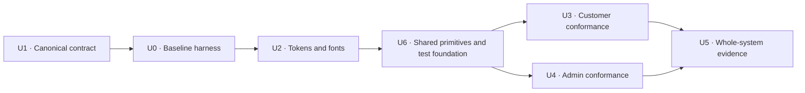

# Refactor: Align Café Le Den with the DX design contract

## Overview

Replace the legacy prose-only `DESIGN.md` with the canonical DX Harness contract, generate its typed projection and component manifest, then refactor the existing customer and admin interfaces to follow that contract. This is a behaviour-preserving visual and component-system refactor: the current ordering, authentication, data, pricing, tax, bilingual routing, and operational state models remain unchanged.

The product direction is warm, local, and appetite-led for customers, while calm and operational for café staff. Clarity wins when character and utility compete, but neither surface should become generic.

---

## Problem Frame

The current implementation contains a real token layer and a coherent functional prototype, but its design contract is not machine-readable by DX Harness and its components bypass semantic colour and typography rules in many places. The current audits report 20 direct palette-role violations, meaningful typography and sentence-case drift, no component manifest, and a missing `.dx/design.json`. The customer and admin surfaces therefore have good ingredients without a durable, verifiable design system.

The newest Wayfinder re-baseline treats the current product as an asset to refine rather than a rewrite target. The safe implementation boundary is design conformance: improve visual hierarchy, component consistency, responsive composition, and operational legibility without silently resolving still-open service-policy, admin-operating-model, security, or platform decisions.

This is pre-production foundation work, not evidence that the service is ready to launch. Release remains gated by the open order-integrity, authorization, recovery, and platform decisions below; visual readiness must never be reported as operational readiness.

---

## Requirements Trace

- R1. Define the ten-section Café Le Den design language and generate a fresh `.dx/design.json` that DX Harness can consume.
- R2. Preserve all current customer and admin behaviour: EN/FR routing, guest pickup ordering, pay-in-person, GST/QST totals, server validation, Supabase-backed admin operations, and current status transitions.
- R3. Make the customer experience appetite-first, locally trustworthy, mobile-first at 320px, and visually consistent across homepage, menu, checkout, and confirmation.
- R4. Make the admin experience neutral, dense, high-contrast, and operationally scannable without introducing new queue states or policies.
- R5. Replace role-bearing raw palette utilities and off-contract typography with semantic, accessible design-system roles; preserve true acronyms and use tabular numerals where values align or update.
- R6. Declare the current component system in a validated partial component manifest and prefer existing Base UI/shadcn primitives over bespoke controls where behaviour remains equivalent.
- R7. Retain reduced-motion support, visible focus, bilingual layout resilience, and semantic loading/empty/error distinctions already present.
- R7.1. For every modified interactive control, preserve programmatic names/states, associated and announced errors, overlay focus trap/return, meaningful live-state announcements, and at least a 44×44 CSS-pixel touch target in both languages where the control is touch-facing.
- R8. Introduce no recurring software cost, no framework swap, and no new runtime dependency. A free, development-only browser-test dependency is allowed for characterisation and regression evidence.
- R9. Record the approved Fraunces display-face exception as a named product override while keeping Inter as the sole body/UI face and removing the unapproved third mono face.

---

## Scope Boundaries

- Do not change database schemas, Supabase policies, authentication semantics, server actions, cart calculations, order tax rules, API validation, email behaviour, or realtime ordering behaviour.
- Do not add scheduling, capacity, duplicate-submission policy, customer accounts, loyalty, payments, delivery, PWA behaviour, multi-location support, staff roles, audit logs, or new order states.
- Do not replace the current data fallback contract or decide the still-open hosting, security, retention, recovery, or rollout architecture.
- Do not treat plausible fallback café data as newly authoritative content.
- Do not replace the established logo, cream/forest/orange palette, watermelon motif, EN/FR parity, or pay-in-person pickup model.

### Deferred to Follow-Up Work

- Order idempotency, transactional writes, modifier-price trust, and realtime insert races remain under the open pickup/service and domain/security decisions.
- Admin allowlisting, recovery/cancellation policy, pagination, and degraded-mode behaviour remain under the open admin operating-model and platform tickets.
- Missing/ambiguous backend error states and sample-data fallbacks remain reliability work, not visual conformance work.

---

## Context & Research

### Relevant Code and Patterns

- `src/app/[locale]/layout.tsx` and the locale pages preserve Server Component data boundaries; interactive state stays in narrow client leaves under `src/components/`.
- `src/app/admin/(dashboard)/layout.tsx` and admin pages preserve server-side authentication/data loading while client components call existing server actions.
- `src/app/globals.css` already contains the colour ramps, semantic shadcn roles, type tokens, spacing, radii, shadows, motion, and reduced-motion guard to reconcile rather than replace.
- `src/components/ui/` is the primitive source of truth; `src/app/dev/components/page.tsx` is the existing visual gallery.
- `src/components/admin/status.ts`, `src/components/admin/page-header.tsx`, and `src/components/admin/order-card.tsx` centralise status and dense operational patterns.

### Institutional Learnings

- The Wayfinder re-baseline says to preserve the polished functional prototype but plan production around honest operational and data contracts (`.planning/wayfinder/research/current-product-rebaseline.md`).
- Previous verification missed multiline native controls and overstated conformance; use harness checks plus rendered keyboard/browser verification, not grep alone (`.planning/phases/01-design-system-foundation-brand-expression/VERIFICATION.md`).
- Custom typography utilities have collided with Tailwind colour utilities and produced incorrect CTA foregrounds; every primitive/type change needs rendered contrast verification (`.planning/wayfinder/research/current-product-rebaseline.md`).
- Token changes previously missed chart/sidebar aliases and decorative motion; inventory all semantic consumers before renaming or removing tokens (`.planning/phases/01-design-system-foundation-brand-expression/01-02-SUMMARY.md`).
- Preserve Server/Client Component boundaries: component functions cannot cross RSC serialization boundaries, and client directives should stay at narrow interactive leaves (`node_modules/next/dist/docs/01-app/01-getting-started/05-server-and-client-components.md`).

### External References

- Customer benchmark evidence: `.planning/wayfinder/research/customer-facing-benchmarks.md`.
- Café operations benchmark evidence: `.planning/wayfinder/research/cafe-operations-benchmarks.md`.
- DX Harness catalogue and procedures are supplied by the installed user-scoped harness; product artifacts generated from it remain committed here.

---

## Key Technical Decisions

- Replace, do not patch, the legacy `DESIGN.md`: the new file carries only product decisions in the ten canonical sections, with catalogue citations and no restated controls.
- Use Fraunces variable at 500/600 for display/headings and Inter at 400/500/600 for body/UI. Record a TYP-1 L1 product override approved by Jeongwon Do in this session; remove Geist Mono and use Inter with tabular figures for operational numbers.
- Keep the existing cream/forest/orange ramps, but expose role-specific semantic tokens for accent text/surfaces and operational statuses. Components consume roles, not direct palette steps.
- Use a hand-maintained, `coverage: partial` component manifest first. Complete import-diff coverage is unsafe until re-exports and composite patterns are catalogued.
- Define partial coverage precisely: every stable file in `src/components/ui/`, plus shared customer/admin composites modified by this refactor. Routes, one-off page compositions, and unmodified feature-local components stay outside the claimed manifest coverage.
- Migrate tokens compatibility-first: add semantic roles, retain existing aliases, migrate and verify customer/admin consumers, then remove only aliases proven unused. Do not combine role introduction and alias deletion in one change.
- Preserve the existing page and data architecture. Refactor composition and styling inside current boundaries instead of moving server work into client components.
- Keep `src/components/admin/status.ts` directive-free and side-effect-free so it remains safe for both server and client consumers; it exposes presentation metadata only and never imports actions, hooks, or browser APIs.
- Treat the storefront and admin as related expressions of one system: the storefront uses warmer composition and appetite-led imagery; admin uses the same roles with lower warmth, denser rhythm, sentence-case status labels, and tabular operational figures.
- Add Playwright as a development-only dependency and use characterisation-first browser checks around shared high-blast-radius components before and after each conformance cluster.
- Run authenticated mutation tests only against an explicitly configured, seeded local or non-production Supabase target. They are disabled by default, reject the documented production target, use synthetic records, and clean up deterministically.

### Server/Client Boundary Contract

| Surface | Server owner | Interactive client leaf | Invariant |
|---------|--------------|-------------------------|-----------|
| Localised storefront | `src/app/[locale]/layout.tsx` and route pages | Header, homepage, menu, cart/order composites | Pass serialisable props only; no server-only imports enter client graphs; locale/data fetching stays server-side. |
| Admin | `src/app/admin/(dashboard)/layout.tsx` and dashboard route pages | Sidebar, orders dashboard, filters, forms | Authentication/data loading stays server-side; client leaves call the existing server actions with unchanged payloads. |
| Shared order-status vocabulary | Server and client consumers | None owned by the module | `src/components/admin/status.ts` remains directive-free, deterministic, and presentation-only. |

### Surface Priority Contract

| Route/surface | First three information groups | Dominant action | Responsive persistence |
|---------------|--------------------------------|-----------------|------------------------|
| Customer home | Appetite/identity; open-and-place proof; featured menu | Order pickup | Header and pickup action stay available; secondary story/review content may move below the fold. |
| Customer menu | Availability context; category navigation; menu items | Add/select an available item | Categories remain horizontally reachable; cart recovery/sticky action persists when populated. |
| Checkout | Cart and exact totals; pickup choice; customer details | Submit pickup order | Summary remains before submission; rows stack without changing edit/remove affordances. |
| Confirmation | Order reference/state; pickup details; exact summary | Return to menu/storefront | Reference and pickup truth stay above secondary detail at every viewport. |
| Admin live orders | Urgent queue/status; order age/details; next valid transition | Advance the selected order | Desktop columns may stack/collapse on narrow screens without hiding status or the next action. |
| Admin history/detail | Filters/search; order identity/status; detail/actions | Inspect or update the selected order | Filters collapse before core order identity; status and action remain paired. |
| Admin menu/categories/settings | Page context; current persisted state; editable fields | Save the current change | Destructive actions stay secondary; fields stack without changing names, values, or submit semantics. |

### Benchmark Acceptance Scorecard

| Benchmark decision | Observable evidence | Pass threshold |
|--------------------|---------------------|----------------|
| Lune-style appetite-led entry plus BOSSA local trust | EN/FR 320px first viewport | Branded food/product focal point, one dominant pickup action, and open/place proof are visible without competing primary actions. |
| Chipotle/Starbucks modifier-to-pickup clarity | EN/FR menu → modifier → cart → checkout → confirmation | Selection, price delta, pickup choice, exact totals, order reference, and recovery/exit remain visible and behaviourally unchanged. |
| Uber Eats-style status/recovery truth | Empty, invalid, failed-submit, closed, and confirmation direct-entry scenarios | Each state explains what happened and exposes the existing next action; no failure is styled as success. |
| Toast Orders Hub control-tower hierarchy | Seeded desktop admin board including dense/100+ order fixture evidence | Active states, order age/identity, and next action scan without horizontal page overflow or colour-only status. |
| Square/Toast status and exception handling | Existing New → Preparing → Ready → Picked up and Cancel paths | Text/icon status, pending feedback, failure recovery, and unchanged action payloads are evidenced. |
| Square Sales Summary / Toast lean analytics | Analytics at desktop and narrow admin viewport | Primary metrics lead, figures use tabular alignment, and supporting charts/tables do not compete with the summary. |

---

## Open Questions

### Resolved During Planning

- Which design language is authoritative? The new DX contract, current user-approved essence/colour/typography decisions, current Wayfinder evidence, and shipped code primitives; the legacy `DESIGN.md` and old Editorial New declaration are historical inputs only.
- Which display typeface should ship? Fraunces, recorded as the product-specific TYP-1 override; Inter remains the body/UI face.
- Should this work redesign behaviour? No. It is a bounded design and component conformance refactor.
- Should a complete component manifest be claimed? No. Start partial and expand only with verified coverage.

### Deferred to Implementation

- Exact semantic status-token names may follow the existing `ORDER_STATUS` and `MENU_STATUS` vocabulary once every consumer is inventoried.
- Native controls should move to existing primitives only where focus, keyboard, pending, and form semantics remain equivalent; specialised segmented controls stay composites and enter the manifest.
- Harness detector findings that are demonstrable false positives are documented rather than “fixed” into incorrect visual output.

---

## High-Level Technical Design

> *This illustrates the intended approach and is directional guidance for review, not implementation specification. The implementing agent should treat it as context, not code to reproduce.*

---

## Implementation Units

- U1. **Establish the canonical DX product contract**

**Goal:** Replace the legacy design document with the approved ten-section contract, generate its typed projection, declare the component inventory, and create the durable design-run/approver records.

**Requirements:** R1, R6, R8, R9

**Dependencies:** None

**Files:**
- Modify: `DESIGN.md`
- Create: `.dx/design.json`
- Create: `.dx/component-manifest.json`
- Create: `docs/decisions/APPROVER.md`
- Create: `docs/design-tickets/design-system-conformance.md`
- Create: `docs/design-tickets/TODO.md`

**Approach:**
- Encode the confirmed essence, colour, and typography plus the inferred tokens, motion, voice, layout, component, and guardrail decisions.
- Use exact machine-readable layout bullets and valid override grammar.
- Register the partial inventory of stable primitives and high-blast-radius composites with their canonical imports.
- Record implementation drift as TODOs; do not alter product code in this unit.

**Patterns to follow:**
- DX Harness `docs/templates/DESIGN.md` and `docs/DESIGN-CONTEXT.md`.
- Existing primitives in `src/components/ui/` and the gallery in `src/app/dev/components/page.tsx`.

**Test scenarios:**
- Test expectation: none -- this unit creates documentation/generated configuration, validated by the DX generator and manifest validator rather than application behaviour tests.

**Verification:**
- The design generator creates `.dx/design.json` and immediately passes `--check`.
- The component manifest validator passes and reports partial coverage honestly.
- The TYP-1 override is accepted by the generator with a reason and named approver.

- U0. **Establish the pre-change characterisation harness**

**Goal:** Capture a trustworthy before-state for the highest-blast-radius customer/admin shells before any production CSS, font, or primitive changes.

**Requirements:** R2, R7, R8

**Dependencies:** U1

**Files:**
- Modify: `package.json`
- Modify: `package-lock.json`
- Modify: `.gitignore`
- Create: `playwright.config.ts`
- Create: `playwright.gallery.config.ts`
- Create: `tests/e2e/storefront-design.spec.ts`
- Create: `tests/e2e/admin-design.spec.ts`

**Approach:**
- Add `@playwright/test` as a free development dependency; do not add runtime packages or services.
- Run real customer/admin route characterisation against a production build, but run the guarded `/dev/components` gallery check through the separate development-server config because that route intentionally returns 404 in production.
- Capture the benchmark-scorecard scenarios and representative keyboard/reduced-motion/responsive evidence before U2 changes product code, then repeat the same assertions after each conformance cluster.
- Keep authenticated mutation coverage disabled unless an explicit seeded local/non-production Supabase target is provided. Reject the documented production project, use synthetic `e2e-` records, and clean them up deterministically; otherwise record those rows as blocked/unverified.
- Read admin credentials only from ignored local environment variables or CI secrets using a least-privilege test account. Never give browser tests a Supabase service-role key or commit authentication state.
- Ignore Playwright auth state, reports, traces, video, and screenshots by default; staged-file verification must reject secrets, session artifacts, customer PII, and authenticated trace data.

**Patterns to follow:**
- Next.js Playwright guidance in `node_modules/next/dist/docs/01-app/02-guides/testing/playwright.md`.
- Existing server-rendered routes and public data fallbacks; browser specs interact through routes rather than importing server modules.

**Test scenarios:**
- EN and FR public home/menu/order shells render at 320, 768, and 1440px with baseline overflow, keyboard, and reduced-motion evidence.
- Unauthenticated admin login/redirect and available shell states are characterised without credentials.
- Authenticated read/mutation rows either run against the explicit safe target or remain visibly blocked; skipped coverage is never reported as passed.

**Verification:**
- Playwright discovers both suites; the stable public and unauthenticated baseline scenarios pass before U2 begins.
- The gallery development configuration reaches `/dev/components`, while the production build continues to hide it.
- No browser artifact, credential, storage state, customer PII, or production mutation is staged.

- U2. **Reconcile semantic tokens and typography**

**Goal:** Make the shared design foundation express the new contract without token-role ambiguity or unapproved typefaces while retaining compatibility for existing consumers.

**Requirements:** R5, R6, R7, R8, R9

**Dependencies:** U0

**Files:**
- Modify: `src/app/globals.css`
- Modify: `src/app/layout.tsx`

**Approach:**
- Inventory every brand, chart, sidebar, status, focus, and motion consumer before changing token aliases.
- Add or clarify semantic roles for brand accent and operational statuses; keep the underlying ramps and existing public aliases as compatibility primitives until U3/U4 verification passes.
- Keep Geist Mono and the existing mono alias temporarily if any consumer remains. Migrate consumers to Inter plus `tabular-nums`; remove the loader/alias only in U5 after customer/admin verification proves no use remains.
- Align type sizes with the catalogue scale, preserve compact labels at the 12px floor, and keep headings at their display line heights rather than applying body leading.

**Patterns to follow:**
- Semantic shadcn role mapping in `src/app/globals.css`.
- Explicit `variant` and `size` usage demonstrated in `src/app/dev/components/page.tsx`.
- Next.js font loading guidance in `node_modules/next/dist/docs/01-app/01-getting-started/13-fonts.md`.

**Test scenarios:**
- Compatibility: pre-existing semantic aliases continue to resolve while consumers are migrated.
- Typography: customer display headings render in Fraunces; UI/body and operational figures render in Inter with tabular figures where declared.

**Verification:**
- Existing consumers compile before any legacy alias is removed.
- Token/type audits have no unexplained new findings; known detector false positives are documented.

- U6. **Conform shared primitives and validate the shared direction**

**Goal:** Make shared controls/gallery conform to the contract and independently validate the direction before customer/admin consumers change.

**Requirements:** R2, R5, R6, R7, R8

**Dependencies:** U2

**Files:**
- Modify: `src/components/ui/button.tsx`
- Modify: `src/components/ui/dropdown-menu.tsx`
- Modify: `src/components/ui/tabs.tsx`
- Modify: `src/components/ui/stars.tsx`
- Modify: `src/app/dev/components/page.tsx`

**Approach:**
- Extend the pre-change behaviour characterisation without replacing its baseline; isolate live-data variability from stable navigation, semantics, keyboard, and layout assertions.
- Reconcile Button, DropdownMenu, Tabs, Stars, and the shared gallery against semantic roles and the sentence-case/type contract.
- Ensure focus treatment remains visible and recognised by both rendered interaction and static checks.
- Gate U3/U4 on the gallery plus one representative customer shell and one representative admin shell rendering correctly with legacy consumers still present.
- Spawn a separate DX design-review agent following the installed DX reviewer instructions. Resolve its blocking findings against the contract and benchmark scorecard before U3/U4; the builder does not grade its own work.

**Patterns to follow:**
- Next.js Playwright guidance in `node_modules/next/dist/docs/01-app/02-guides/testing/playwright.md`.
- Explicit primitive variants/sizes in `src/app/dev/components/page.tsx`.
- Existing Server/Client Component boundaries; tests interact through rendered routes, not imported server modules.

**Test scenarios:**
- Primitive variants preserve their existing accessible names, keyboard activation, disabled/pending states, and visible focus.
- Public homepage/menu/order shells load in EN and FR before feature refactoring begins.
- Admin tests explicitly skip with a recorded reason when required Supabase/auth environment is unavailable; skipped coverage is never reported as passed.

**Verification:**
- Playwright discovers both suites and the stable unauthenticated/public characterisation scenarios pass.
- CTA foregrounds remain legible, focus is visible by keyboard, and reduced-motion behaviour remains intact in the gallery and representative shells.
- The independent DX review accepts the shared direction with no blocking finding before U3/U4 begin.

- U3. **Conform the bilingual customer journey**

**Goal:** Apply the contract across the existing customer journey while preserving all current state and data behaviour.

**Requirements:** R2, R3, R5, R7, R8

**Dependencies:** U6

**Files:**
- Modify: `src/app/[locale]/layout.tsx`
- Modify or verify unchanged: `src/app/[locale]/page.tsx`
- Modify or verify unchanged: `src/app/[locale]/menu/page.tsx`
- Modify or verify unchanged: `src/app/[locale]/order/page.tsx`
- Modify: `src/app/[locale]/order/confirmation/page.tsx`
- Modify: `src/components/layout/header.tsx`
- Modify: `src/components/layout/footer.tsx`
- Modify: `src/components/layout/announcement-banner.tsx`
- Modify: `src/components/home/hero.tsx`
- Modify: `src/components/home/featured.tsx`
- Modify or verify unchanged: `src/components/home/reviews.tsx`
- Modify or verify unchanged: `src/components/home/review-marquee.tsx`
- Modify or verify unchanged: `src/components/home/story.tsx`
- Modify or verify unchanged: `src/components/home/section-skeleton.tsx`
- Modify or verify unchanged: `src/components/brand/open-status.tsx`
- Modify: `src/components/home/sticky-order-bar.tsx`
- Modify: `src/components/home/visit.tsx`
- Modify: `src/components/menu/menu-content.tsx`
- Modify: `src/components/order/order-content.tsx`
- Modify or verify unchanged: `src/lib/cart-store.ts`

**Approach:**
- Preserve server shells, serialisable props, route/locale contracts, query parameters, cart persistence key and state shape, item/modifier semantics, form fields/payloads, pending/error states, focus restoration, validation, tax display, and navigation.
- Make the first phone viewport appetite-first with one dominant pickup action and immediate place/open proof using existing content/assets only.
- Replace role-bearing direct ramp utilities with semantic roles, remove decorative uppercase, raise sub-floor labels, and apply tabular figures to prices/totals/counts where alignment matters.
- Use existing Base UI/shadcn primitives for language and action controls when their interaction contract matches; document specialised modifier, quantity, and pickup-time composites in the manifest.
- Verify French expansion, safe-area padding, category scrolling, focus visibility, programmatic names/states, overlay focus trap/return, announced/associated errors, 44×44 touch targets, and reduced-motion fallback at 320px.

**Execution note:** Characterise the complete EN/FR menu-to-checkout-to-confirmation flow before modifying shared Header, menu, order, confirmation, or sticky-cart components. Include order reference, totals, pickup information, reload/direct-entry fallback, and the primary return path; use a synthetic fixture or record a blocked row when live submission is unavailable.

**Patterns to follow:**
- Locale/data boundary in `src/app/[locale]/layout.tsx`.
- Cart state in `src/lib/cart-store.ts` and current menu/order client leaves.
- Existing brand primitives under `src/components/brand/`.

**Test scenarios:**
- Happy path: EN and FR users navigate home → menu → item modal → add → checkout → confirmation without changed cart contents, totals, order reference, pickup truth, exit path, or routes.
- Edge case: sold-out remains visible but disabled; hidden remains absent; an empty cart still presents its menu recovery action.
- Edge case: quantity and modifier controls preserve their current values, minimums, price deltas, and persisted cart state across reload and locale switch.
- Error path: invalid customer fields and failed order submission retain data and show the existing recovery path without visual ambiguity.
- Integration: open/closed café state, announcement, contact details, and pickup choices remain fed by existing server data.
- Accessibility: keyboard focus, screen-reader names/states and live feedback, associated errors, overlay focus trap/return, 44×44 touch targets, reduced motion, 320px EN/FR composition, and no horizontal overflow hold across the journey.

**Verification:**
- Browser comparison proves unchanged customer behaviour and improved hierarchy at 320, 768, and 1440px.
- Customer files pass applicable token, typography, accessibility, lint, type, and build checks.

- U4. **Conform the café operations interface**

**Goal:** Apply the contract to admin navigation, status, order, menu, analytics, category, and settings surfaces without changing policies or mutations.

**Requirements:** R2, R4, R5, R6, R7, R8

**Dependencies:** U6

**Files:**
- Modify or verify unchanged: `src/app/admin/layout.tsx`
- Modify: `src/app/admin/(dashboard)/layout.tsx`
- Modify: `src/app/admin/(dashboard)/page.tsx`
- Modify or verify unchanged: `src/app/admin/login/page.tsx`
- Modify or verify unchanged: `src/app/admin/(dashboard)/categories/page.tsx`
- Modify or verify unchanged: `src/app/admin/(dashboard)/settings/page.tsx`
- Modify: `src/app/admin/(dashboard)/menu/page.tsx`
- Modify or verify unchanged: `src/app/admin/(dashboard)/menu/new/page.tsx`
- Modify or verify unchanged: `src/app/admin/(dashboard)/menu/[id]/edit/page.tsx`
- Modify: `src/app/admin/(dashboard)/orders/page.tsx`
- Modify or verify unchanged: `src/app/admin/(dashboard)/orders/[id]/page.tsx`
- Modify: `src/components/admin/sidebar.tsx`
- Modify: `src/components/admin/page-header.tsx`
- Modify: `src/components/admin/stat-strip.tsx`
- Modify: `src/components/admin/status.ts`
- Modify: `src/components/admin/orders-dashboard.tsx`
- Modify: `src/components/admin/order-card.tsx`
- Modify: `src/components/admin/orders-filter.tsx`
- Modify: `src/components/admin/period-selector.tsx`
- Modify: `src/components/admin/analytics-dashboard.tsx`
- Modify: `src/components/admin/menu-item-row.tsx`
- Modify: `src/components/admin/menu-item-form.tsx`
- Modify: `src/components/admin/categories-manager.tsx`
- Modify: `src/components/admin/settings-form.tsx`

**Approach:**
- Keep current auth guards, server pages, query parameters, form fields/payloads, action boundaries, pending/error states, focus restoration, status paths, realtime wiring, and mutation payloads untouched. Preserve explicit loading/empty/error UI where it exists; do not invent a distinction where current query failures are already coerced to empty data.
- Centralise operational state presentation through semantic status roles with text/icon redundancy; reserve brand orange for accent rather than overloading warning/status meaning.
- Use sentence-case labels, stable tabular figures, clear hierarchy, and denser rhythm than the storefront while retaining the brand frame.
- Replace native controls only when the existing primitive preserves focus, keyboard, pending, and form behaviour. Manifest specialised KDS/status/filter patterns instead of flattening them into generic buttons.
- Preserve current mobile off-canvas behaviour while improving its visible focus and state affordance within the design-only boundary.

**Execution note:** Characterise order progression, menu status transitions, filters, and form submission before modifying shared admin components.

**Patterns to follow:**
- `src/components/admin/status.ts` as the single state-presentation vocabulary.
- `src/components/admin/page-header.tsx` for dense sans operational hierarchy.
- Current server-action boundaries in `src/app/admin/(dashboard)/**/actions.ts`.

**Test scenarios:**
- Happy path: New → Preparing → Ready → Picked up and Cancel continue to invoke the same actions with the same pending/success/error feedback.
- Happy path: menu availability/sold-out/hidden transitions, category edits, settings saves, and order filters preserve existing payloads and navigation.
- Edge case: empty KDS columns and empty order history remain distinct from explicit loading/errors where the application already represents those states; existing query-error-as-empty ambiguity stays deferred reliability work and is recorded as unverified/TODO evidence.
- Error path: failed status/form actions retain the existing error/toast recovery and do not appear successful.
- Integration: desktop sidebar, mobile drawer, page headers, status chips, tables, and shared order cards remain visually and behaviorally consistent.
- Accessibility: status is never colour-only; controls expose programmatic names/states; meaningful live changes and errors are announced; drawer/overlay focus is trapped then returned; touch-facing controls meet 44×44; numeric data aligns without jitter; narrow admin views do not introduce new overflow.

**Verification:**
- Browser comparison proves unchanged admin behaviour and the benchmark-scorecard scanning thresholds at desktop and mobile breakpoints available without new credentials.
- Authenticated mutation scenarios require an explicitly configured, seeded local/non-production Supabase target and least-privilege test account. The suite rejects the documented production target and otherwise records mutation rows as blocked/unverified while still running login, shell, static, and build coverage.
- Admin files pass applicable token, typography, accessibility, lint, type, and build checks.

- U5. **Verify, review, and ratchet the combined result**

**Goal:** Produce whole-system evidence against the contract and preserve unresolved design findings durably.

**Requirements:** R1-R9

**Dependencies:** U3, U4

**Files:**
- Modify: `src/app/globals.css`
- Modify: `src/app/layout.tsx`
- Modify: `.dx/component-manifest.json`
- Modify: `docs/design-tickets/design-system-conformance.md`
- Modify: `docs/design-tickets/TODO.md`
- Create: `docs/design-reviews/2026-08-15-dx-conformance.md`

**Approach:**
- Re-run the design projection/manifest validators and all applicable deterministic DX checks.
- Run lint, TypeScript, and production build verification without masking unrelated failures.
- Capture customer EN/FR and admin evidence at the defined breakpoints, then spawn a separate DX design-review agent following the installed reviewer instructions over the combined outcome; the builder does not grade its own work.
- Remove only compatibility aliases and the Geist loader proven unused after U3/U4 verification; keep any alias with a surviving consumer and record it instead of forcing deletion.
- Consolidate the manifest here after both surface inventories are known; claim only stable UI primitives and modified shared composites, and list explicit exclusions behind `coverage: partial`.
- Fix in-scope findings; classify genuine detector gaps, open Wayfinder policy gaps, and out-of-scope reliability defects into the durable TODO record.
- Record an evidence matrix with one row per scenario and columns for benchmark decision, route/locale, viewport, auth prerequisite, safe target/fixture, state reached, behaviour parity, accessibility, pass threshold, visual verdict, and artifact/link.
- Use synthetic customer/order data in captured admin evidence. Redact unavoidable live values; never commit or publicly link customer PII, authentication state, or session-bearing traces. Keep sensitive artifacts ignored/private with a short documented retention window and perform a PII/staged-file check before linking evidence.

**Test scenarios:**
- Integration: the generated design projection is fresh and both customer/admin files consume declared semantic roles and manifest components.
- Regression: every pre-refactor characterisation scenario still reaches the same state with the same persisted or submitted data.
- Accessibility: focus, contrast, reduced motion, sentence case, tabular operational figures, and responsive overflow are checked in rendered output.
- Failure evidence: unavailable credentials or live services are reported as unverified rather than inferred as passing.

**Verification:**
- No review-blocking in-scope finding remains unresolved.
- The design ticket records the approved plan, TYP-1 override, review verdict, fixes, and any explicitly deferred work.

---

## System-Wide Impact

- **Interaction graph:** Shared token and primitive changes fan out to all customer and admin components; Header, StickyOrderBar, AdminSidebar, OrderCard, and central status maps are the highest-blast-radius consumers.
- **Error propagation:** Existing server/action/API errors keep their current paths. Styling must not hide errors, convert failures into empty states, or imply success.
- **State lifecycle risks:** Cart persistence, pending action state, realtime order state, and form dirty state must survive component substitutions unchanged.
- **API surface parity:** No API, schema, server-action signature, query-parameter contract, form field/payload, translation key contract, route/locale contract, or persisted Zustand key/shape changes.
- **Integration coverage:** Browser characterisation is required because lint/static checks cannot prove focus management, RSC serialization, responsive composition, or state continuity.
- **Unchanged invariants:** Customer order semantics, admin status progression, taxes, business hours, authentication, data ownership, and zero-cost constraints remain unchanged.

---

## Risks & Dependencies

| Risk | Mitigation |
|------|------------|
| Semantic token renaming changes contrast or status meaning | Inventory all consumers; introduce roles before replacing uses; verify rendered contrast and state labels. |
| Primitive substitution changes keyboard/focus/form behaviour | Substitute only with behaviour-equivalent existing primitives; browser-test keyboard and pending states. |
| Font/type utilities collide with Tailwind colour utilities | Verify CTA foregrounds in the gallery and real surfaces after every type change. |
| Client-boundary movement breaks RSC serialization or inflates bundles | Preserve server shells and narrow client leaves; avoid moving data fetching or component functions across boundaries. |
| Live Supabase/Google data makes screenshots unstable or exposes customer PII | Use synthetic fixtures for captured evidence, redact unavoidable live values, keep sensitive artifacts ignored/private, and report unavailable states honestly. |
| Admin verification is blocked by missing safe-target credentials | Gate authenticated Playwright rows on an explicit seeded local/non-production target and least-privilege account; otherwise run login/shell/static/build coverage and mark mutations unverified. |
| Browser tests mutate production | Disable mutations by default, reject the documented production Supabase target, prefix synthetic records, and require deterministic cleanup. |
| A broad visual pass accidentally decides open product policy | Enforce the behaviour-preserving scope and defer service, security, recovery, and platform questions to their existing Wayfinder tickets. |

---

## Documentation / Operational Notes

- The new `DESIGN.md`, `.dx/design.json`, and `.dx/component-manifest.json` become the committed source for future DX Harness runs.
- Regenerate `.dx/design.json` after every approved `DESIGN.md` change; never hand-edit it.
- The component manifest begins partial and must not claim complete import coverage until all composites and re-exports are verified.
- No new recurring service, paid plugin, or runtime package is introduced. Playwright is development-only test infrastructure.

---

## Sources & References

- User-approved DX design decisions from this session.
- `.planning/PROJECT.md`
- `.planning/brand/SPEC.md`
- `.planning/wayfinder/maps/cafe-le-den-zero-cost-platform.md`
- `.planning/wayfinder/research/current-product-rebaseline.md`
- `.planning/wayfinder/research/customer-facing-benchmarks.md`
- `.planning/wayfinder/research/cafe-operations-benchmarks.md`
- `.planning/phases/01-design-system-foundation-brand-expression/VERIFICATION.md`
- `node_modules/next/dist/docs/01-app/01-getting-started/05-server-and-client-components.md`
- `node_modules/next/dist/docs/01-app/01-getting-started/13-fonts.md`
