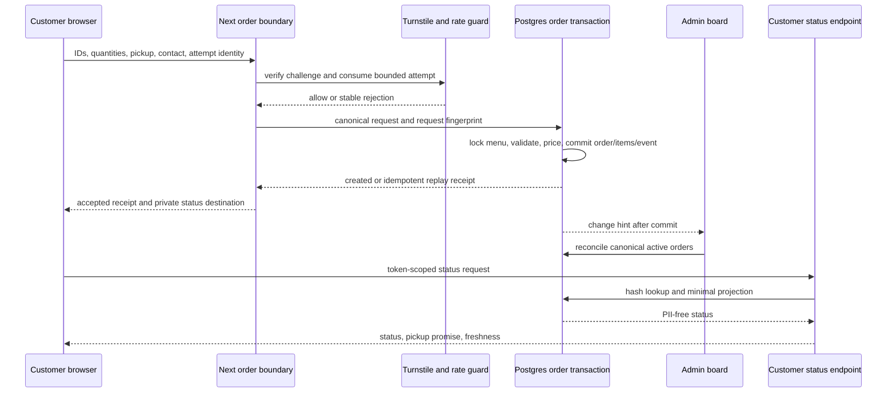
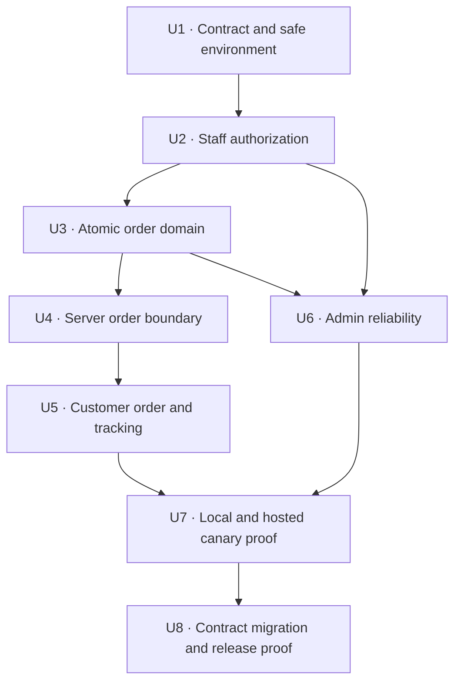
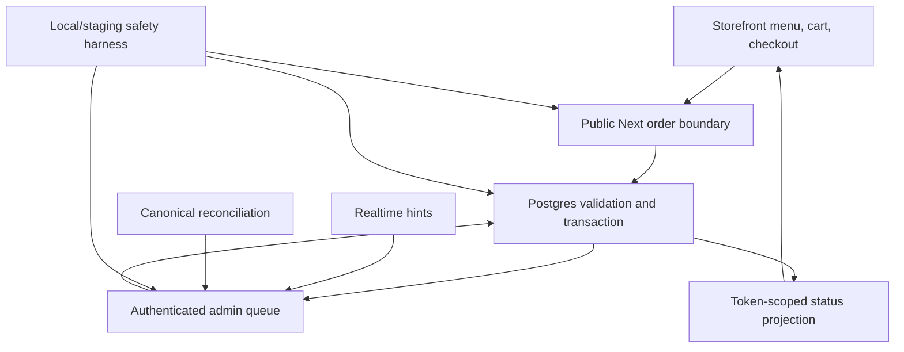

# feat: Harden the pickup order lifecycle

## Overview

Turn the existing polished pickup-ordering prototype into a verifiable single-café order system without adding payments, customer accounts, new order states, multi-location abstractions, or recurring software spend.

The hardened flow must make Postgres the authority for menu availability, modifier selection, pickup promises, money, idempotency, and order transitions. The customer-facing Next.js route remains the only public write boundary. Café staff keep the current `new → preparing → ready → picked_up` board with cancellation, but Realtime becomes an acceleration layer over canonical reconciliation rather than the sole reliability mechanism. Customers receive a private, PII-free status view through an opaque tracking secret and visible-page polling.

This plan deliberately promotes order integrity, customer status, abuse protection, and real lifecycle testing from the old deferred backlog. The user explicitly authorized that promotion on 2026-08-24 after the design iteration showed that visual readiness did not prove production correctness.

---

## Problem Frame

The customer and admin code is connected, but the current implementation cannot guarantee that the same complete order moves safely across both surfaces:

- anonymous database clients can bypass `/api/order` and insert fabricated orders;
- the API validates base prices only when usable item IDs are supplied, trusts modifier prices from the browser, and fails open on several data-read failures;
- order headers and line items are separate writes, allowing partial orders and Realtime races;
- retries have no idempotency contract;
- every authenticated Supabase user is treated as an admin;
- order transitions are UI convention rather than a database-enforced state machine;
- Realtime errors silently disable live updates and there is no polling reconciliation;
- the confirmation page uses a guessable display number as the lookup credential and does not provide live status;
- existing Playwright coverage mocks order creation and never exercises authenticated mutations.

The prior design plan intentionally preserved these behaviors. This plan supersedes that boundary for order lifecycle work while preserving the approved product shape: one Montréal café, EN/FR customer experience, guest checkout, same-day pickup, pay in person, and a lean staff admin.

---

## Requirements Trace

- R1. All new orders and line snapshots are validated and committed atomically; no partial order can exist.
- R2. The database derives item names, modifier ownership, prices, tax, totals, and the pickup promise from authoritative rows and Montréal-local configuration. Browser-supplied display or price values are never persisted as truth.
- R3. Every checkout attempt is idempotent. Identical retries return one committed order; reuse with changed contents returns a conflict.
- R4. New public order requests fail closed behind bounded runtime validation, origin-aware throttling, and mandatory server-validated Turnstile outside explicit local/test mode.
- R5. Only explicitly allowlisted staff can read order PII or mutate café data. Every protected action and database policy reauthorizes independently.
- R6. The database enforces `new → preparing → ready → picked_up`, allows cancellation only from active states, keeps terminal states immutable, detects concurrent staff conflicts, and records one customer-PII-free lifecycle event with a restricted staff actor UUID per committed transition.
- R7. The admin exposes connection freshness and reconciles the canonical active-order set after subscribe, reconnect, focus, mutation, and polling fallback. Missed or out-of-order events cannot duplicate or regress orders.
- R8. Customers can revisit a bilingual status view using a high-entropy bearer secret that is absent from request URLs, logs, referrers, and database plaintext. Status responses expose no customer PII or internal identifiers.
- R9. A reproducible local Supabase stack and an explicitly marked non-production target prove Auth, RLS, RPC, Realtime, idempotency, and cleanup. Production credentials and real customer data are impossible to select from the test harness.
- R10. Failure states distinguish invalid input, closed service, menu/price change, abuse verification, conflict, uncertain receipt, dependency outage, and stale tracking without exposing raw infrastructure errors.
- R11. The lifecycle remains inside the zero-additional-cost envelope: Supabase Free/local development, Cloudflare Turnstile, the admin board, and polling. Per-order email is not a correctness or alert dependency.
- R12. The design and behavior invariants remain: EN/FR customer parity, accessible recovery, guest pay-at-pickup, current order states, current GST/QST labels, one café, and no customer account.

---

## Scope Boundaries

- Do not add online payment, delivery, customer accounts, loyalty, POS integration, native apps, multi-location support, or multi-tenant abstractions.
- Do not add acknowledgement, hold, refund, or other order states. `new` means the atomic commit was accepted into the café queue and is awaiting preparation.
- Do not implement future-day scheduling in this phase. Pickup is explicit `asap` or a same-day Montréal-local scheduled time.
- Do not expose orders, order items, tracking hashes, rate-limit rows, or staff membership directly to anonymous clients.
- Do not use the display order number as authorization or retain a privileged service-role query in a page component.
- Do not make Realtime, email, notification audio, or client button disabling a correctness dependency.
- Do not migrate or reset production, create a paid resource, or run a mutation against an unverified target.
- Do not silently promote sample menu, hours, price, address, or phone data to production authority. Live ordering fails honestly when authoritative data is unavailable.
- Do not build a general staff-role system or broad audit product. The allowlist has one admin/staff capability, and the event ledger covers order lifecycle only.

### Deferred to Follow-Up Work

- Hosted Cloudflare/OpenNext deployment and Worker CPU/load proof remain a separate platform phase.
- Production backup destination, PII retention period, archive/purge policy, restore ownership, and launch cutover require café-owner approval before release.
- Private Realtime Broadcast may replace Postgres Changes if volume or authorization needs outgrow this single-café implementation.
- Future-day ordering may use `max_advance_order_days` only after a separate date-selection and capacity decision.
- General menu-edit transaction hardening, image pipeline work, and authoritative café content remain outside this order-lifecycle slice unless required by the tests below.

---

## Context & Research

### Relevant Code and Patterns

- `src/app/api/order/route.ts` is the current public write boundary and must become a thin Route Handler over a server-only order data layer.
- `src/lib/types.ts`, `src/lib/supabase/queries.ts`, `src/components/menu/menu-content.tsx`, and `src/lib/cart-store.ts` currently discard modifier/option identities and persist browser-derived prices.
- `supabase/migrations/001_initial_schema.sql` through `004_menu_item_status.sql` are the canonical migration history. New work uses additive migrations; previously applied files are not rewritten.
- `src/app/admin/(dashboard)/layout.tsx`, `src/lib/supabase/auth.ts`, and each Server Action already have session checks to strengthen into allowlist authorization.
- `src/components/admin/orders-dashboard.tsx` already owns initial state plus Postgres Changes and is the natural boundary for connection health, reconciliation, and polling.
- `tests/e2e/storefront-design.spec.ts` and `tests/e2e/admin-design.spec.ts` provide safe UI characterization but currently mock order success and skip real mutations.
- `src/messages/en.json` and `src/messages/fr.json` already contain several recovery concepts that should become a stable error-code mapping rather than raw server strings.

### Institutional Learnings

- `.planning/wayfinder/research/current-product-rebaseline.md` classifies the repository as a functional prototype and names modifier trust, anonymous inserts, idempotency, rate limiting, admin authorization, timezones, and degraded operation as production blockers.
- `.planning/wayfinder/research/zero-cost-operating-envelope.md` requires server-only inserts, modifier verification, idempotency, Turnstile, rate limiting, fixed staff, Realtime health, polling reconciliation, off-platform backup, and honest outage behavior.
- `.planning/wayfinder/research/cafe-operations-benchmarks.md` establishes stable order identity, the existing forward state sequence, explicit cancellation, connectivity freshness, and a narrow event trail as the essential single-café contract.
- `.planning/wayfinder/research/customer-facing-benchmarks.md` requires a durable receipt, honest acceptance/pickup truth, recovery without duplicate submission, and EN/FR continuity.
- `docs/design-reviews/2026-08-15-dx-conformance.md` records that no real customer order or admin mutation was executed.
- `.context/compound-engineering/ce-code-review/20260823-235650-dx/summary.md` records a not-ready verdict and the remaining error-recovery/mutation coverage gaps.

### Framework Guidance

- Next.js 16 treats Route Handlers as public endpoints and requires bounded input validation, authentication/authorization at each mutation, minimal return values, rate limiting for expensive writes, and server-only data access: `node_modules/next/dist/docs/01-app/01-getting-started/15-route-handlers.md`, `node_modules/next/dist/docs/01-app/02-guides/backend-for-frontend.md`, and `node_modules/next/dist/docs/01-app/02-guides/data-security.md`.
- Supabase recommends migration-led local development and pgTAP for schema, RLS, function, and integrity testing: [local workflow](https://supabase.com/docs/guides/local-development/cli-workflows), [migrations](https://supabase.com/docs/guides/local-development/database-migrations), and [testing](https://supabase.com/docs/guides/local-development/testing/overview).
- Supabase requires grants and RLS together, recommends pinned search paths and narrowly granted function execution, and warns that secret/service keys bypass RLS: [securing the Data API](https://supabase.com/docs/guides/api/securing-your-api), [database functions](https://supabase.com/docs/guides/database/functions), [RLS](https://supabase.com/docs/guides/database/postgres/row-level-security), and [API keys](https://supabase.com/docs/guides/getting-started/api-keys).
- Supabase Postgres Changes does not replay missed events; subscription status must trigger canonical reconciliation. Current guidance favors private Broadcast at larger scale, while authenticated Postgres Changes remains reasonable for this bounded single-café board: [database changes](https://supabase.com/docs/guides/realtime/subscribing-to-database-changes) and [subscribe statuses](https://supabase.com/docs/reference/javascript/subscribe).
- Cloudflare requires server-side Turnstile validation; tokens are short-lived and single-use, Siteverify supports safe retry identifiers, and deterministic test keys are available: [validation](https://developers.cloudflare.com/turnstile/get-started/server-side-validation/) and [testing](https://developers.cloudflare.com/turnstile/troubleshooting/testing/).

---

## Key Technical Decisions

| Decision | Chosen contract | Rationale |
| --- | --- | --- |
| Database evolution | Harden the existing public tables with additive grants, RLS, constraints, and narrowly executable RPCs | Moving live tables to a new schema would create a high-risk cutover unrelated to the immediate integrity goal. A private schema remains appropriate for helpers and future restructuring. |
| Atomic creation | One Postgres transaction validates canonical rows and inserts the header, line snapshots, initial event, idempotency record, and tracking hash | Realtime cannot observe a partial commit, and any raised error rolls back the complete attempt. |
| RPC privilege | Service-only `SECURITY INVOKER` creation/recovery/rate RPCs and an authenticated `SECURITY DEFINER` transition RPC, all with fully qualified objects, empty pinned search paths, and explicit grants | The server secret key is fully privileged and contained to one server-only module; it is key custody—not RLS—that bounds that backend blast radius. Staff transitions derive `auth.uid()` and re-check live allowlist membership inside the routine. |
| Money | PostgreSQL `numeric` calculations using database configuration, one documented order-level rounding rule, and snapshotted applied rates | Preserves current numeric columns while removing JavaScript-float and browser-price authority. |
| Idempotency | Browser creates an attempt UUID and independent 256-bit tracking secret before first submit; the database verifies a versioned canonical fingerprint that includes the token digest and all material normalized semantics | Lost-response recovery can find/replay one order without retaining or echoing the raw bearer secret. Challenge, network identity, JSON key order, and presentation ordering are excluded from the fingerprint. |
| Acceptance | Successful atomic commit means accepted into the queue; `new` means accepted and not started | The customer confirmation cannot over-promise a later manual acceptance step that does not exist in the state model. |
| Pickup | Explicit `asap` or same-day `scheduled`; database creates and validates a concrete `promised_pickup_at` in `America/Toronto` | Removes nullable ambiguity, UTC-date construction errors, and unenforced future-order promises. |
| Tracking transport | Raw tracking secret arrives in a URL fragment, is immediately removed with `history.replaceState`, and remains only in status-page session state; an explicit Copy Link action reconstructs the fragment | Fragments avoid request/referrer leakage, and immediate consumption reduces browser-history/script exposure while preserving refresh, locale switching, and intentional sharing. |
| Customer status | Poll a PII-free status DTO only while visible, stop on terminal states, retain and label the last known state when stale | Avoids anonymous order-table/Realtime access and keeps request volume bounded. |
| Admin live updates | Preserve authenticated Postgres Changes for this single café, but treat events as invalidation hints and reconcile canonical state | Lower implementation complexity than Broadcast today; correctness no longer depends on event delivery or ordering. |
| State concurrency | Conditional database transition with expected current state/version and a same-transaction event insert | Concurrent advance/cancel attempts produce one winner, one safe conflict, and no contradictory history. |
| Abuse control | Durable, quickly expiring rate buckets keyed by an HMAC of a trusted proxy identifier, plus mandatory Turnstile and an optional outer Cloudflare WAF rule | In-memory limits do not work across serverless instances; raw IP addresses are not retained. |
| Alerts | The active admin board, health state, and polling are primary. Remove per-order Resend from the acceptance path | Per-order email exceeds the researched free envelope and cannot define whether an order exists. |
| Test environment | Reproducible local Supabase is mandatory; a separately owner-confirmed hosted non-production project is the merge gate when account access and a free slot are available; a real staging hostname is a distinct launch gate | Local work can proceed safely now without conflating hosted database proof, deterministic Turnstile testing, and a deployed edge/hostname proof. |

### Order State Contract

- `new → preparing | cancelled`
- `preparing → ready | cancelled`
- `ready → picked_up | cancelled`
- `picked_up` and `cancelled` are terminal.
- Legacy orders remain admin-visible. They are not made publicly trackable by predictable backfill tokens.
- No rollback or recall transition is added in this phase.

### Data Minimization Contract

- The create response returns a receipt, display order number, accepted status, promised pickup time, computed totals, and immutable item snapshots. It never returns the browser-owned tracking secret, its hash, or the idempotency key.
- Status polls return display order number, status, status version, promised pickup time, update time, and café recovery/contact information. A distinct token-scoped recovery response may additionally return the same PII-free authoritative totals and immutable item snapshots needed after a dropped create response.
- Neither response returns customer name/phone, internal UUIDs, staff identity, notes, idempotency keys, tracking hashes, or raw database rows.
- Customer name and phone are removed from long-lived cart persistence and general application logs.

---

## Open Questions

### Resolved During Planning

- Should this remain a visual-only refactor? No. The user explicitly authorized production order-lifecycle hardening after reviewing the architecture boundary.
- Does `new` mean submitted or accepted? Accepted into the queue and not yet preparing. Closed/unavailable requests fail before commit. This phase uses the staff-controlled ordering pause and an owner-validated lead time as its deliberately simple capacity gate rather than pretending to have an automated slot-capacity model.
- Should new order states be introduced? No. Preserve the approved five-state vocabulary.
- Should future-day scheduling ship now? No. Preserve the actual same-day UI and enforce it honestly.
- Should customer tracking use anonymous Supabase Realtime? No. Use a token-scoped same-origin polling endpoint.
- Should Realtime migrate to Broadcast immediately? No. Preserve Postgres Changes for one café and make canonical reconciliation the correctness layer.
- Should per-order email remain? No. It is optional notification work, not part of acceptance or the zero-cost primary alert path.
- Can hosted staging block all implementation? No. Build and prove migrations locally first; stop before any remote mutation until the target is explicitly authenticated and classified non-production.

### Deferred to Implementation

- Exact bounded input values should be selected from the current menu/cart shapes, then locked in tests before the public route is switched. The contract must include streamed request bytes, line count, quantity, modifiers per line, name/phone lengths, and maximum order value.
- Use a 15-second degraded polling target and a slower 60-second healthy safety reconciliation unless browser/load evidence requires a stricter value. Tests may inject scaled intervals while proving the same state machine and freshness contract.
- The hosted non-production project reference, production project denylist, least-privilege test account, and Turnstile staging widget are unavailable locally and require user account access before remote verification.
- Current and next Supabase key naming must be supported without exposing secret/service credentials. Prefer publishable/secret keys for a new project while keeping explicit legacy compatibility during migration.

### Release Blockers Requiring Owner Authority

- Café-owner-approved menu, modifiers, prices, hours, lead time, phone, and address.
- Customer PII retention/deletion period and who owns lawful handling.
- Backup destination, encryption custody, restore operator, and acceptable recovery point.
- Production migration window, rollback decision, manual ordering fallback, and launch sign-off.

---

## High-Level Technical Design

> *This illustrates the intended approach and is directional guidance for review, not implementation specification. The implementing agent should treat it as context, not code to reproduce.*

The implementation-unit dependency graph is:

---

## Implementation Units

- U1. **Lock the lifecycle contract and safe database environment**

**Goal:** Make the newly authorized production-hardening scope durable and establish a reproducible local/non-production database harness before changing behavior.

**Requirements:** R9, R11, R12

**Dependencies:** None

**Files:**
- Modify: `.planning/PROJECT.md`
- Modify: `.planning/REQUIREMENTS.md`
- Modify: `.planning/STATE.md`
- Create: `docs/order-lifecycle-contract.md`
- Create: `supabase/config.toml`
- Create: `supabase/seed.sql`
- Create: `supabase/bootstrap/environment-sentinel.sql`
- Create: `supabase/tests/001_environment_contract.test.sql`
- Modify: `.env.local.example`
- Modify: `.gitignore`
- Modify: `package.json`
- Modify: `package-lock.json`
- Create: `tests/e2e/helpers/supabase-target.ts`
- Create: `scripts/cleanup-lifecycle-test.mjs`

**Approach:**
- Promote atomic creation, customer status, abuse protection, admin allowlisting, degraded operation, and real lifecycle testing from the stale deferred requirements into a named hardening milestone.
- Initialize the local Supabase configuration around the existing `001`–`004` migration history rather than pulling from or mutating an unknown remote.
- Replace the monolithic migration seed convention with a deterministic local/staging seed entry point while preserving applied migration files. Pin the Supabase CLI and one TypeScript unit runner in the lockfile.
- Require an independent mutation-target handshake: URL-derived project ref equals `EXPECTED_STAGING_PROJECT_REF`; `PRODUCTION_PROJECT_REF` is present and different; `LIFECYCLE_MUTATION_TARGET=staging:<ref>` matches; and a protected database sentinel reports `staging`. Local mode accepts only the committed loopback URL/ports and sentinel. Environment strings alone never classify a hosted project.
- Define the sentinel as one checksum-pinned, idempotent bootstrap SQL artifact outside the normal migration chain. The preflight may normalize only this exact private table/value when comparing a not-yet-migrated target; `005_order_lifecycle_expand.sql` adopts/validates the same object so all later drift baselines include it.
- Before hosted work, compare migration history and generated schema/types read-only with the committed baseline. The only pre-baseline exception is the exact checksum-pinned sentinel bootstrap artifact defined below; any other drift stops the run and requires a reconciliation migration. Never auto-repair history or rewrite `001`–`004`.
- Seed synthetic menu/hours fixtures. U1 creates only the environment and target-safety prerequisites; U2 owns creation of the synthetic Auth user and allowlist row after the schema exists.
- Assign every run a unique ID, record exact created IDs/idempotency identities, delete only those exact records, and provide interruption-recovery cleanup. Never use broad prefix/date cleanup.
- Add the prerequisite checker plus initial local reset/seed/target-safety scripts. U7 completes the aggregate `verify:order-lifecycle:local` command after the database, unit, race, browser, and cleanup suites exist.

**Execution note:** Establish the local reset and safety checks before any feature migration. Apart from the one-time owner-approved sentinel bootstrap defined in U7, the remote target remains untouched until the complete handshake proves it is non-production.

**Patterns to follow:**
- Existing migration order in `supabase/migrations/`.
- Existing explicit Playwright mutation gates in `tests/e2e/admin-design.spec.ts`, strengthened beyond URL inequality.
- Supabase migration/seed/pgTAP workflow from the official local development docs.

**Test scenarios:**
- Safety: missing target marker, missing production denylist, matching production/staging refs, malformed URLs, or absent cleanup capability all reject mutation mode.
- Safety: a forged environment marker cannot override a mismatched or absent protected database sentinel, and loopback-only test adapters reject hosted URLs.
- Reproducibility: a clean local reset applies `001`–`004`, deterministic seed data, and the environment contract without dashboard changes.
- Privacy: no secret/service key, auth state, raw tracking token, real customer PII, or hosted project linkage is staged.
- Hosted handoff: when no free hosted slot or credentials exist, local verification remains usable and remote operations remain explicitly blocked.

**Verification:**
- A new contributor can recreate the database and synthetic fixtures locally from committed files.
- The prerequisite and environment checks are executable before later units depend on them; the final one-command lifecycle proof is U7's completion gate.
- The test harness cannot select production by omission, string alias, or URL mismatch alone.
- The planning/requirements state no longer presents lifecycle hardening as silently deferred.

---

- U2. **Enforce staff allowlisting and least-privilege data access**

**Goal:** Ensure that only explicitly allowlisted staff can reach admin order PII or mutate café data, while anonymous clients lose every direct order-write path.

**Requirements:** R4, R5, R9

**Dependencies:** U1

**Files:**
- Create: `supabase/migrations/005_order_lifecycle_expand.sql`
- Create: `supabase/tests/002_admin_authorization.test.sql`
- Create: `src/lib/supabase/admin.server.ts`
- Modify: `src/lib/supabase/auth.ts`
- Modify: `src/proxy.ts`
- Modify: `src/app/admin/(dashboard)/layout.tsx`
- Modify: `src/app/admin/(dashboard)/actions.ts`
- Modify: `src/app/admin/(dashboard)/menu/actions.ts`
- Modify: `src/app/admin/(dashboard)/categories/actions.ts`
- Modify: `src/app/admin/(dashboard)/settings/actions.ts`
- Modify: `src/app/api/upload-menu-image/route.ts`
- Test: `tests/e2e/admin-design.spec.ts`

**Approach:**
- Add a protected single-role staff allowlist keyed to Supabase Auth user IDs and a non-recursive database membership helper. Node-side setup creates one exact synthetic Auth user, inserts its UUID into the allowlist through the local/hosted Admin API, passes only email/password to the browser, and deletes/revokes exact fixtures after the run.
- Before canary, provision every legitimate staff identity and replace every broad authenticated policy for orders, café content, modifiers, Storage, and related tables with allowlist-aware RLS. PostgreSQL permissive-policy OR semantics mean a broad compatibility policy cannot coexist with a meaningful denial claim.
- Drop anonymous order/order-item inserts in the expand migration because the current server route already uses its server credential and no legitimate browser depends on those policies.
- Preserve only the direct update shapes the old authenticated admin application genuinely requires, and only for allowlisted staff, until U8 revokes those shapes after the RPC-capable application canary.
- Keep Proxy limited to session refresh/optimistic routing. Protected layouts, Server Actions, upload handlers, and server data access each call a shared server-only staff authorizer.
- Make initial staff enrollment a documented service-controlled operation, never self-enrollment or a public action.

**Execution note:** Add negative pgTAP coverage before changing application guards so privilege regressions fail at the database boundary.

**Patterns to follow:**
- Independent action-level authentication already present in admin Server Actions.
- Next.js server-only DAL and per-mutation authorization guidance.
- Supabase grants-plus-RLS and fixed-search-path helper guidance.

**Test scenarios:**
- Anonymous users cannot insert, select, update, or delete order/order-item rows.
- Authenticated but unlisted users cannot access order PII, admin pages, Data API reads/writes, transition functions, café mutations, uploads, or the allowlist before application canary begins.
- Allowlisted staff can perform the existing authorized menu/settings/order operations.
- Removing a staff membership invalidates subsequent actions even when the browser still has an authenticated session.
- A direct Server Action or Route Handler request cannot rely only on the admin layout or Proxy check.
- Local seed/setup can create the first synthetic staff member without committing a hosted user ID.

**Verification:**
- pgTAP proves exact grants, helper privileges, allowlist-aware RLS outcomes, and denial paths for anon, ordinary authenticated, and staff roles before canary. U8 separately proves that allowlisted staff can no longer bypass transition RPCs with direct order-status updates.
- Admin routes and actions fail closed with safe 401/403 behavior rather than raw Supabase errors.

---

- U3. **Expand the atomic, idempotent order and transition domain**

**Goal:** Move order correctness into additive Postgres migrations that validate authoritative configuration, commit complete snapshots, prevent duplicates, secure tracking, and serialize staff transitions.

**Requirements:** R1, R2, R3, R4, R6, R8, R9, R10

**Dependencies:** U2

**Files:**
- Create: `supabase/migrations/006_atomic_order_creation_expand.sql`
- Create: `supabase/migrations/007_order_state_transitions_expand.sql`
- Create: `supabase/tests/003_atomic_order_creation.test.sql`
- Create: `supabase/tests/004_order_transitions.test.sql`
- Create: `supabase/tests/005_tracking_and_rate_limits.test.sql`
- Create: `src/lib/supabase/database.types.ts`

**Approach:**
- Add nullable compatibility fields plus an explicit lifecycle contract version for legacy rows, including idempotency identity/fingerprint version, tracking hash/expiry, promised pickup, status version, and snapshotted tax configuration. New RPC-created rows satisfy conditional stricter constraints; legacy rows remain admin-visible but untrackable.
- Add a narrow customer-PII-free, staff-restricted order-status event table and quickly expiring HMAC-keyed rate buckets. Neither is directly readable by anonymous clients; any retained staff actor UUID is pseudonymous audit data covered by the owner-approved retention policy.
- Canonicalize menu availability on `status`, reject unknown historical values during preflight, and keep `available = (status <> 'hidden')` compatible until removal. Test migration against dirty legacy combinations; use `NOT VALID` then validation where appropriate rather than silently coercing unknown data.
- Enforce one authoritative café configuration, fixed `America/Toronto`, bounded tax/lead-time/hours values, and explicit `ordering_enabled`; missing or duplicate configuration fails closed.
- Add authoritative modifier cardinality metadata with `min_selections` of 0 or 1 and `max_selections = 1` for this single-select UI. Preserve required Size/Milk-style groups while allowing optional paid Add-on groups; the owner-approved catalog decides each real group's minimum before launch. Empty groups, selections below/above the configured bounds, duplicate groups/options, and unavailable options reject.
- In one transaction, validate bounded payload structure, require real menu/option identities, lock the parent menu-item rows before reading price/options, validate modifier ownership/cardinality, validate authoritative hours/lead time/same-day pickup, compute numeric subtotal/tax/total, insert header and complete line snapshots, and write the initial lifecycle event.
- Make the narrow menu item/modifier save touched by checkout transactional too: one RPC locks the same parent row, updates the item, replaces its modifier graph, and commits as one unit. Checkout and admin edits therefore cannot observe a half-replaced modifier graph.
- Define one documented order-level cent-rounding rule and snapshot the applied GST/QST rates.
- Generate the display order number collision-safely in the database. It remains a human identifier, never a credential.
- Make idempotency concurrency-safe: the database verifies normalized/sorted material semantics plus the unique tracking digest under a versioned fingerprint; same identity/fingerprint returns the original committed receipt, changed content/token conflicts, and a failed transaction leaves no parent, line, event, or consumed idempotency result. Retention lasts at least through the tracking/retry window.
- Use a provisional local/staging retention contract that keeps tracking/recovery and its matching idempotency protection available until 72 hours after the promised pickup time, then makes the token unavailable. Quickly expiring create/status/recovery rate buckets are prunable independently. Production values remain an owner-approved launch gate, and cleanup can never remove idempotency protection while its receipt is recoverable.
- Store only the hash of the customer tracking bearer secret. Invalid, expired, and revoked lookups are indistinguishable and return a minimal projection.
- Revoke all unintended routine execution explicitly. Creation/recovery/rate routines use fully qualified objects, an empty pinned search path, and service-only execution. The transition routine derives `auth.uid()`, checks live membership, and accepts expected state/version.
- Enforce the legal transition graph/version for every writer with a database trigger or equivalent invariant, including the elevated server role. Every committed status change automatically creates exactly one matching `(order_id, status_version)` event; item snapshots and events are immutable to application roles. Terminal actions require explicit confirmation in U6; mistakes use the documented owner recovery procedure rather than an untracked direct database reversal.
- New-contract orders cannot commit without at least one item, the initial event, exact total equations, valid nonnegative money, promised pickup, tax snapshots, idempotency identity, or unique tracking digest. Staff actor UUID is restricted pseudonymous audit data—not literally PII-free—and remains owner-retention-gated.
- Ensure a menu price/availability update and checkout serialize to one coherent outcome rather than a mixed snapshot.
- Put Montréal clock-dependent logic behind private helpers that accept an explicit test clock; production wrappers always supply database time, and public/authenticated roles cannot execute the clock-injected helpers.

**Execution note:** Implement grants, constraints, rollback, pricing, transition, and tracking behavior test-first with pgTAP. Prove actual races separately with two independent clients and explicit database barriers/locks; timing-only `Promise.all()` is not sufficient. Generate `database.types.ts` from the completed local schema and fail on drift.

**Patterns to follow:**
- Existing enum and order snapshot tables in `001_initial_schema.sql`.
- Existing `updated_at` triggers, tightened with explicit versioning where lifecycle concurrency needs it.
- Official Postgres unique-constraint, locking, transaction, and Supabase function/grant patterns.

**Test scenarios:**
- Atomicity: a forced line failure creates no order, lines, status event, or visible tracking record.
- Idempotency: simultaneous identical attempts produce one complete order and one initial event; changed cart, contact, or pickup under the same identity conflicts.
- Pricing: forged names/base prices/modifier adjustments/tax/total are absent from the input contract or cannot affect persisted values.
- Modifiers: unknown options, wrong-item options, duplicate groups/options, missing required choices, excess choices, and unavailable menu rows reject atomically.
- Modifiers: optional groups accept zero or one configured option, required groups accept exactly one, and current Add-on fixtures never force a paid selection.
- Concurrency: a price/sold-out update concurrent with checkout yields either a coherent committed old snapshot or a coherent new-state rejection/reprice.
- Concurrency: replacing the complete modifier graph during checkout also resolves serially; no mixed old/new graph is observable.
- Pickup: ASAP, first valid scheduled slot, last valid slot, exact close, closed day, lead-time boundary, Montréal midnight/DST, malformed hours, and paused/unavailable configuration have explicit outcomes.
- Time determinism: fixed-clock tests cover Montréal midnight/DST, rate-window, and token-expiry boundaries without accepting caller-controlled time in the public contract.
- Money: fractional-cent combinations prove the chosen order-level rounding and snapshotted rates.
- Tracking: only a hash is stored; valid secret returns the minimal projection; order number alone, invalid/expired/revoked secrets return the same absence result.
- Rate limiting: buckets increment atomically, reject beyond the bound with a retry window, retain no raw network address, and are prunable.
- Authorization: function execution is denied to unintended roles; no default public routine privilege remains.
- Transitions: every allowed edge increments version and writes one event; skipped, terminal, stale-version, and disallowed cancellation attempts fail.
- Staff race: simultaneous advance/cancel yields one winner, one conflict, and no contradictory event.
- Privilege: direct staff/server attempts to bypass totals, items, events, status graph, or versioning fail; removing allowlist membership blocks the next transition even with an existing JWT.
- Compatibility: migrations apply to legacy active/terminal orders, null new fields, known historical availability values, and stale dual-field combinations; unknown values abort with diagnostics.

**Verification:**
- Local database tests prove complete rollback, authoritative pricing, duplicate prevention, privacy, privilege boundaries, and state serialization without application mocks.
- New order rows always have complete line snapshots, an initial event, a pickup promise, idempotency identity, and a tracking hash.
- Multi-connection integration tests deterministically prove simultaneous create, menu-edit/checkout, advance/cancel, and stale-version outcomes by persisted row/event counts.

---

- U4. **Build the secure server order boundary**

**Goal:** Replace the monolithic, fail-open order Route Handler with a thin validated boundary over server-only abuse, pricing, tracking, and repository modules.

**Requirements:** R1, R2, R3, R4, R8, R10, R11

**Dependencies:** U2, U3

**Files:**
- Create: `src/lib/orders/contracts.ts`
- Create: `src/lib/orders/errors.ts`
- Create: `src/lib/orders/repository.server.ts`
- Create: `src/lib/orders/abuse.server.ts`
- Create: `src/lib/orders/tracking.server.ts`
- Create: `src/lib/orders/time.server.ts`
- Create: `src/lib/supabase/privileged.server.ts`
- Modify: `src/app/api/order/route.ts`
- Create: `src/app/api/order/status/route.ts`
- Create: `src/app/api/order/recover/route.ts`
- Create: `tests/unit/order-contracts.test.ts`
- Create: `tests/unit/order-errors.test.ts`
- Create: `tests/unit/order-time.test.ts`
- Modify: `package.json`

**Approach:**
- Mark privileged data access server-only and use a distinct non-cookie Supabase client for the narrowly granted secret/service path. Cookie-aware staff clients remain separate.
- Strictly parse JSON, content type, the streamed body size (not only `Content-Length`), locale, contact fields, item IDs, option IDs, integer quantities, pickup mode, same-day wall time, attempt UUID, tracking secret shape, and Turnstile token. Reject unexpected legacy price/name fields with `CLIENT_REFRESH_REQUIRED` rather than silently trusting them.
- Normalize a canonical request representation for the database fingerprint. It excludes challenge/network identity and presentation order but includes every material semantic plus the tracking digest.
- Validate same-origin browser requests and expose no permissive CORS. Consume a cheap create rate bucket using an HMAC of the trusted platform client identifier; ignore arbitrary `X-Forwarded-For`. Accept `CF-Connecting-IP` only when origin bypass is prevented by the deployment profile; otherwise missing trusted identity or versioned HMAC configuration disables ordering safely outside loopback test mode.
- Validate Turnstile server-side with expected action and environment hostname, a bounded timeout, and explicit test configuration. Production/staging fails closed when required keys are absent.
- Resolve committed idempotent replay before requiring a fresh single-use challenge: after bounds and the cheap abuse bucket, match attempt identity + fingerprint + tracking digest and return the existing receipt. Changed semantics/token conflict. If no committed match exists, require a fresh valid challenge before creation. An in-flight match waits boundedly or returns `RECEIPT_UNCERTAIN`; it never creates a second order.
- Call the atomic creation RPC once and map created, replayed, conflict, menu, hours, challenge, throttle, validation, refresh-required, uncertain, and dependency outcomes to stable HTTP/domain codes.
- Use Siteverify's own retry identity only for uncertain Siteverify network retries. A fresh Turnstile token never implies a fresh order attempt, and a consumed token is not re-used to create.
- Remove PII from logs. Remove per-order Resend from the acceptance path; no notification result changes the committed order response.
- Make the status endpoint accept the bearer secret in a POST body, hash it server-side, return a minimal no-store projection, use an independent status rate bucket, and use the same status/body/timing class for invalid/expired/revoked values. The recovery endpoint returns the PII-free authoritative receipt needed after an ambiguous create response and uses its own bounded durable bucket after cheap shape validation, so recovery traffic cannot starve create or routine status polling.
- Set explicit `Cache-Control: private, no-store, max-age=0` and `Referrer-Policy: no-referrer`; prove Next/CDN cannot cache status changes. Keep tracking pages/endpoints free of third-party analytics and apply the restrictive CSP defined in U5.
- Extract testable private time helpers that accept an injected clock. Production wrappers always pass database/server time; no public payload can control `now`. Revoke database helper execution from browser roles.

**Execution note:** Start with failing unit tests for payload bounds, canonical fingerprints, time normalization, domain-code mapping, and target/header trust before replacing the current route.

**Patterns to follow:**
- Next.js Route Handler and server-only DAL guidance read from the installed 16.2.1 docs.
- Existing localized error-focus behavior in `src/components/order/order-content.tsx`.
- Existing `America/Toronto` helpers in `src/lib/hours.ts`, extended rather than duplicated where appropriate.

**Test scenarios:**
- Valid create returns `201`; an identical committed replay returns `200`; changed content under the same idempotency identity returns `409`.
- Malformed JSON, wrong content type, excessive bytes/lines/quantity/modifiers/value, invalid locale/contact/pickup, unknown fields, and invalid secret/challenge shapes fail before the RPC.
- Missing authoritative café/menu configuration returns ordering unavailable rather than accepting sample/fallback data.
- Turnstile success, failure, expiry, replay-safe verification, timeout, wrong action, wrong hostname, and missing production keys map to safe outcomes.
- Ambiguity: commit/drop recovers without another create or challenge; pre-commit network failure probes absence then obtains a fresh challenge for the same attempt; uncertain Siteverify retries only its verification call.
- Origin throttling returns `429` with a retry window and remains effective across route instances.
- Raw Postgres, Supabase, Cloudflare, secret key, customer PII, and tracking values never enter client errors or general logs.
- Status requests are no-store, PII-free, indistinguishable for invalid credentials, and stop exposing the old order-number lookup.
- Spoofed proxy headers, forged/absent content length, unexpected origins, missing HMAC identity, and bucket-store outage fail closed; create, status, and recovery buckets cannot starve each other.

**Verification:**
- The Route Handlers contain orchestration only; privileged secrets and domain/database behavior live in server-only modules.
- No request can create an order without bounded validation, abuse checks, and the atomic RPC.

---

- U5. **Upgrade checkout identity, recovery, receipt, and customer tracking**

**Goal:** Submit only authoritative identities, survive ambiguous responses without duplicate orders, and give customers a private bilingual status experience.

**Requirements:** R2, R3, R4, R8, R10, R12

**Dependencies:** U4

**Files:**
- Modify: `src/lib/types.ts`
- Modify: `src/lib/supabase/queries.ts`
- Modify: `src/lib/cart-store.ts`
- Modify: `src/components/menu/menu-content.tsx`
- Modify: `src/components/order/order-content.tsx`
- Modify: `src/app/[locale]/order/confirmation/page.tsx`
- Create: `src/app/[locale]/order/status/page.tsx`
- Create: `src/components/order/order-status.tsx`
- Modify: `src/messages/en.json`
- Modify: `src/messages/fr.json`
- Modify: `tests/e2e/storefront-design.spec.ts`
- Create: `tests/unit/checkout-attempt.test.ts`

**Approach:**
- Preserve modifier and option UUIDs through the menu query, shared types, item dialog, cart, and request. Submit only menu item IDs, option IDs, quantities, locale, explicit pickup mode/time, contact, attempt identity, tracking secret, and challenge token.
- Keep client price calculations as labelled estimates for immediate UI feedback, but replace them with the authoritative receipt after acceptance and never use them as the persisted contract.
- Reserve a stable challenge region above the final submit action and use Turnstile's managed interaction mode. Specify widget-loading, checking, interactive challenge, expired, unavailable, and retry states; preserve entered checkout data, move focus to actionable errors, announce state once, and keep the widget/submit usable by keyboard and at 320px. A fresh challenge never rotates the order attempt.
- Move name and phone out of long-lived Zustand persistence. Keep cart selections durable, but keep PII and the attempt-scoped tracking bearer secret in memory/session storage only.
- Create one attempt identity and independent 256-bit base64url tracking secret before the first submit. Rotate both when cart, contact, or pickup changes before commit. Preserve both across definite retry/ambiguous recovery. Once the receipt is secured, clear only create/idempotency state; retain the tracking secret in the consumed-fragment status session until terminal/expiry/manual removal. Starting another order creates a new pair without deleting the previous status link.
- On an uncertain response, enter an explicit customer state machine: `checking receipt` disables resubmission; `recovered` shows the authoritative receipt; `confirmed not found` offers a same-attempt retry with a fresh challenge; `still uncertain` offers no resubmit action and instead shows café contact/manual recovery. Each transition has deterministic focus and one-time live-region announcements.
- Map stable domain codes to localized recovery: choose another time, review changed menu, verify again, wait after throttling, retry the same attempt, or use the café's manual fallback.
- Use one continuous receipt/status screen: successful checkout navigates directly to `/[locale]/order/status#<secret>`, where authoritative receipt identity/totals/items appear first, live status and promised pickup appear next, and the private-link action sits beside the order identity. Consume and remove the fragment before POSTing for fresh status. The old confirmation route becomes only a PII-free legacy/expired/manual-recovery screen and never performs privileged lookup.
- Add a prominent explicit “Save private order link” control that reconstructs the fragment only on request, explains that closing the tab without saving ends self-service tracking, and confirms copy success. Use `Referrer-Policy: no-referrer`, a tracking-page CSP that prevents third-party script/connection leakage, private no-store responses, and no analytics/crash payload capture on the status page.
- Poll only while the page is visible, stop at terminal status, reconcile by monotonic version, retain the last known state during transient failures, and label freshness/staleness. Announce only meaningful state changes.
- Tell customers explicitly that the page is pull-only rather than a push notification, to save the private link, and that the café may call the submitted phone number if an accepted order must be cancelled. Cancellation recovery exposes the café phone without exposing the customer's PII.
- Preserve tracking across EN/FR switching and copied-link use without placing the secret in query/path requests.

**Execution note:** Characterize current cart persistence first, then add unit coverage for attempt rotation/reuse and Playwright coverage for dropped-response recovery before changing success navigation.

**Patterns to follow:**
- Existing Zustand cart store and localized route navigation.
- Existing checkout single-focus error channel and accessible confirmation hierarchy.
- Existing EN/FR customer benchmark scenarios.

**Test scenarios:**
- Menu mapping preserves modifier/option identities and configured cardinality: optional groups accept zero or one selection, and required groups accept exactly one.
- Long-lived local storage contains cart selections but not customer name, phone, tracking secret, or idempotency identity after abandonment/success.
- Editing cart, pickup, or contact rotates the attempt; retrying unchanged data reuses it.
- A dropped response after commit is recovered through the existing tracking secret, clears the cart once, and creates no second order.
- Uncertain receipt UI proves checking, recovered, confirmed-not-found/retry, and still-uncertain/manual-contact paths without ever enabling an ambiguous duplicate submission.
- The create response contains no raw secret, hash, or idempotency key; the recovered receipt contains authoritative totals/items but no customer PII or internal IDs.
- Definite validation rejection preserves the cart and allows the user to correct the exact field/menu/time issue.
- Authoritative receipt totals replace the estimate and preserve GST/QST/pay-at-pickup truth.
- Valid status shows `new`, `preparing`, `ready`, `picked_up`, or `cancelled` with the promised pickup and safe recovery content.
- Invalid, expired, revoked, or order-number-only lookup reveals no order data and does not show a false success state.
- Polling pauses when hidden, resumes with reconciliation, ignores unchanged/older versions, stops terminally, and labels stale last-known state on outage.
- Refresh, Back/Forward, copied fragment link, and EN/FR switching preserve the token context without leaking it to request URLs/referrers.
- After first bootstrap, the address bar/history no longer contains the token; explicit Copy Link still works, and a new order does not invalidate the previous status session.
- A cached pre-deploy checkout receives bilingual `CLIENT_REFRESH_REQUIRED`, preserves recoverable cart intent, and is never temporarily accepted with legacy names/prices.
- Status changes are announced once; routine unchanged polls do not repeat announcements.
- Keyboard-only checkout/status/Copy Link/challenge recovery, visible focus, 44px targets, deterministic error focus, and no horizontal overflow are verified at 320px in EN and FR.

**Verification:**
- Browser requests contain no item/modifier display prices or names as persisted authority.
- Customers can recover an accepted order and follow its status without an account or access to PII.

---

- U6. **Make admin order operations authorized, reconciled, and conflict-safe**

**Goal:** Ensure the café board stays correct through concurrent staff actions, missed Realtime events, reconnects, midnight boundaries, and dependency failures.

**Requirements:** R5, R6, R7, R9, R10, R12

**Dependencies:** U2, U3

**Files:**
- Create: `src/lib/orders/admin.server.ts`
- Create: `src/lib/orders/admin-realtime.ts`
- Create: `src/app/api/admin/orders/route.ts`
- Modify: `src/app/admin/(dashboard)/page.tsx`
- Modify: `src/app/admin/(dashboard)/orders/page.tsx`
- Modify: `src/app/admin/(dashboard)/orders/[id]/page.tsx`
- Modify: `src/app/admin/(dashboard)/actions.ts`
- Modify: `src/app/admin/(dashboard)/menu/actions.ts`
- Modify: `src/components/admin/orders-dashboard.tsx`
- Modify: `src/components/admin/order-card.tsx`
- Modify: `src/components/admin/status.ts`
- Modify: `tests/e2e/admin-design.spec.ts`

**Approach:**
- Centralize authorized order reads and Toronto day boundaries in a server-only admin order layer. Query all active orders regardless of creation date plus bounded current-day terminal orders so midnight cannot hide unfinished work. SSR and a new no-store authorized admin Route Handler share the same `listAdminOrders()` and versioned DTO.
- Surface initial query failures distinctly from a valid empty queue.
- Subscribe with explicit `Live`, `Reconnecting`, `Polling`, and stale states plus the last successful refresh time.
- Place connection health and a manual Refresh action in the board header. `Live` and fresh `Polling` data may transition through compare-and-set. `Reconnecting` retains last-known orders but labels them degraded. After 45 seconds without a successful canonical refresh, `Stale` disables transition controls until Refresh/poll succeeds; unacknowledged urgency remains visible but is never presented as current truth.
- The client fetches the authorized no-store boundary immediately after subscribe/reconnect, after each mutation, on visibility/network restoration, every 60 seconds while healthy, and every 15 seconds while degraded. Tests may inject scaled clocks without changing the production contract.
- Treat events only as refresh hints. Upsert by ID/version and prevent late event/poll responses from moving state backward or duplicating orders.
- Replace unrestricted status updates with the conditional transition RPC, passing expected state/version. Show safe current-state recovery on conflict and never optimistically claim a transition that lost.
- Route menu item/modifier saves through the transactional RPC defined in U3 so checkout cannot observe the current multi-request delete/reinsert graph.
- Keep the one-next-action hierarchy and terminal-state semantics. Add no new state or recall workflow.
- Add a confirmation-protected “Accepting online orders” control to the live board header and settings surface. Pausing propagates immediately to storefront availability and staff see a persistent paused state; resuming requires an explicit action. This is the phase's deliberately simple rush/emergency capacity control.
- Require explicit confirmation for cancellation and picked-up terminal actions. The cancellation confirmation instructs staff to call the customer before confirming; an accidental terminal action follows the owner runbook because this phase adds no hidden database reversal or unlogged recall edge.
- Keep unrelated sign-out, history, and search-debounce residuals in `docs/residual-review-findings/codex-refactor-dx-design-conformance.md` unless a lifecycle test proves one directly blocks an order operation.
- Use a user-enabled Web Audio cue or another owned local mechanism only after interaction; audio remains secondary to visible freshness/unacknowledged state.

**Execution note:** Add deterministic state/reconciliation tests before replacing the current append/update event handlers.

**Patterns to follow:**
- Existing `ORDER_STATUS`, KDS columns, order-card next-action semantics, and route error/loading components.
- Existing injected preview adapters for analytics, filters, and form races.
- Supabase Realtime subscription status callbacks and Next.js action authorization guidance.

**Test scenarios:**
- Initial query error shows recovery; a genuine empty queue remains an empty success state.
- A manual refresh recovers `Stale`; stale transition controls stay disabled, fresh polling transitions remain available, and compare-and-set conflict recovery is unchanged.
- An order inserted between initial load and subscription appears once with complete line snapshots after reconciliation.
- Realtime timeout/error/close visibly switches to polling; missed inserts/updates arrive within the declared degraded freshness bound.
- Deterministic Realtime-loss tests block the Supabase WebSocket (or an injected transport), assert `Polling`, mutate out of band, wait on state rather than fixed sleep, then restore and prove reconciliation/no regression.
- Reconnect, focus, network return, and post-mutation reconciliation deduplicate by ID and reject older versions.
- An active order survives Montréal midnight and remains stably ordered by promised pickup/FIFO policy.
- Valid transitions succeed once; simultaneous advance/cancel produces one winner and one conflict with the current safe status.
- Retrying an already committed transition does not create a duplicate event or regress state.
- Unlisted users and forged direct action requests cannot query or mutate orders.
- Visible status/connection changes are not color-only and remain usable at the existing mobile/admin widths.
- Pausing rejects new acceptance with bilingual recovery while preserving already accepted orders; resuming restores authoritative availability without a deploy.
- Terminal confirmations are keyboard accessible and cancellation presents the call-before-cancel instruction and customer phone only to allowlisted staff.

**Verification:**
- The admin remains operational when Realtime is absent and never reports stale data as live.
- Canonical database versions determine every rendered order status and transition outcome.

---

- U7. **Prove the real lifecycle locally and through a hosted canary**

**Goal:** Replace mocked confidence with database, browser, failure, cleanup, and operational evidence before any production migration or merge-ready claim.

**Requirements:** R1–R12

**Dependencies:** U4, U5, U6

**Files:**
- Create: `tests/e2e/order-lifecycle.spec.ts`
- Create: `tests/e2e/helpers/order-fixtures.ts`
- Create: `tests/integration/order-concurrency.test.ts`
- Create: `scripts/verify-order-lifecycle-local.mjs`
- Modify: `playwright.config.ts`
- Modify: `tests/e2e/admin-design.spec.ts`
- Modify: `tests/e2e/storefront-design.spec.ts`
- Create: `docs/runbooks/order-lifecycle-staging.md`
- Create: `docs/runbooks/order-recovery.md`
- Create: `docs/runbooks/supabase-backup-restore.md`
- Modify: `README.md`
- Modify: `.planning/STATE.md`

**Approach:**
- Complete `verify:order-lifecycle:local`: prerequisite checks, clean reset/seed, pgTAP, generated-types drift, unit tests, deterministic multi-connection races, production build, real local lifecycle Playwright, lint, TypeScript, and exact cleanup verification.
- Replace the placeholder authenticated mutation test with a real, explicitly gated synthetic lifecycle using a least-privilege staff browser session and service-controlled fixture cleanup outside the browser. The browser never receives a service key.
- Exercise the same production components and Route Handlers used by customers/staff; Turnstile uses official deterministic test configuration only on a target marked non-production.
- Prove the full flow: EN customer submits, admin receives, staff advances through `preparing → ready → picked_up`, customer observes each monotonic version, polling stops terminally, and ordered event count/actor/version are exact. A separate FR flow cancels from an allowed active state and proves localized recovery and terminal immutability.
- Add failure proof for duplicate submissions, changed-payload conflicts, modifier tampering, partial-write rollback, unauthorized roles, invalid transitions, Realtime loss/poll recovery, expired tracking, cleanup, and zero PII/secret leakage.
- Keep hosted proof gated until the owner confirms the separate non-production project and test staff account. Bootstrap ordering is auditable: verify exact project ref and pre-bootstrap history/schema read-only; request authority for the checksum-pinned sentinel SQL only; verify that no artifact except that exact sentinel changed; run the full handshake; then apply committed migrations and compare against the baseline that includes the adopted sentinel. Local proof makes the implementation reviewable but is not merge/launch proof.
- Separate two external gates: hosted Supabase integration runs a local production Next server against hosted staging Auth/RLS/RPC/Realtime with official Turnstile test keys; a later platform gate exercises the actual staging hostname/edge and a real staging widget/action/hostname policy.
- For hosted lifecycle tests, disable or scrub traces/video/network bodies that could capture the synthetic bearer secret, keep artifacts untracked, revoke the token during exact cleanup, and distinguish ephemeral test capture from prohibited application/infrastructure logging.
- Document manual fallback, degraded indicators, production target checks, backup/restore responsibilities awaiting owner assignment, migration ordering, and rollback/cutover gates.
- Add privileged-key lifecycle guidance: distinct local/staging/production keys, named access owners, rotation before launch and after suspected exposure, immediate old-key revocation, deployment restart, and post-rotation denial/audit checks. Do not retain a legacy service-role fallback once the new key scheme is accepted.
- Add an operator launch rehearsal with the actual café owner/staff: name the always-on board device and responsible shift role, prove the device remains awake/attended, exercise Live/Polling/Stale/manual fallback and pause/resume, submit and fulfill synthetic orders, and record sign-off that new-order attention is noticed without relying on audio. This operational gate is what makes database acceptance credible.
- Keep PR #6 as the design dependency and ship this work as a stacked hardening change rather than expanding the design PR's scope.

**Execution note:** Treat the cross-surface lifecycle as the release test, not a demo. A skipped or mocked mutation cannot satisfy the gate.

**Patterns to follow:**
- Existing production-build Playwright configuration and explicit preview/mutation gates.
- Existing synthetic `E2E` naming and network interception safety, replaced with real safe-target writes only inside this suite.
- Official Supabase local/staging migration workflow and Next.js production-server browser guidance.

**Test scenarios:**
- Happy path: EN and FR customer submits → exactly one complete order/initial event → admin receives → valid staff transition/event → customer observes the monotonic status update.
- Full terminal paths: EN reaches picked up through every legal forward transition; FR reaches cancelled from an active state. Both assert exact ordered events, actor attribution, terminal immutability, and PII-free status/recovery DTOs.
- Idempotency: simultaneous identical creates and a lost HTTP response produce one order, one item set, one initial event, one receipt, and one recoverable tracking context.
- Integrity: tampered modifier/price/tax data, invalid option ownership, sold-out changes, malformed hours, and forced line failure never create partial truth.
- Authorization: anon and unlisted authenticated users cannot read PII, mutate status, or use admin functions; allowlisted staff can perform the intended flow.
- Concurrency: concurrent staff actions create one winning transition and one conflict without duplicate events.
- Degraded operation: blocked/dropped Realtime moves admin to polling and still delivers the order/status within the declared bound; reconnect restores live state without duplication.
- Privacy: raw tracking secrets never enter HTTP request URLs, server/access logs, referrers, traces, reports, or committed fixtures. A fragment may exist only during initial bootstrap or an explicit Copy Link action and is removed from the active address bar/history immediately after consumption.
- Cleanup: every synthetic order, event, rate bucket, and test staff artifact is removed or reset deterministically even after failure.
- Cleanup records exact per-run IDs and works through `cleanup:lifecycle-test --run-id …` after interruption or a dropped response; broad prefix/date deletion is forbidden.
- Canary rehearsal: ordering is paused/manual fallback is active, expand migrations apply, the RPC-capable app serves create/read/transition/recovery/tracking, and a failed canary leaves no partial order.
- Regression: design, component gallery, storefront, admin preview, build, TypeScript, lint, and DX controls continue to pass.

**Verification:**
- Local lifecycle proof passes from a clean reset.
- Hosted non-production canary proof passes with real Auth, allowlist RLS, RPC, and Realtime before the expand/application PR is ready for the U8 contract stack.
- The real staging hostname/edge/Turnstile gate plus owner content, retention, backup, and cutover approvals are required before launch-ready may be claimed.
- The authenticated mutation test is no longer a placeholder skip when the safe target is configured.
- Runbooks state exactly what remains owner-gated; no production reset/deploy or paid-resource action is implied.

---

- U8. **Contract legacy mutation paths and prove the final release boundary**

**Goal:** After the hosted application canary passes, remove the last allowlisted-staff direct-update compatibility paths and activate hardened new-row constraints without making an old application rollback possible.

**Requirements:** R1, R5, R6, R9, R10

**Dependencies:** U7 hosted canary

**Files (separate stacked contract PR/release):**
- Create: `supabase/migrations/008_contract_order_grants_and_policies.sql`
- Create: `supabase/migrations/009_contract_order_constraints.sql`
- Create: `supabase/tests/006_contract_denial_and_compatibility.test.sql`
- Modify: `tests/e2e/order-lifecycle.spec.ts`
- Modify: `docs/runbooks/order-lifecycle-staging.md`
- Modify: `docs/runbooks/order-recovery.md`

**Approach:**
- Keep contract SQL outside the active migration chain until the owner-confirmed hosted canary passes. Deliver U8 as a separate stacked PR/release so a normal Supabase migration push cannot apply contract revocations during expand.
- Pause public ordering or activate the manual fallback before the contract migration. Apply `008`/`009`, revoke allowlisted direct order-status mutation and obsolete routine/table privileges, activate new-contract constraints/defaults, then run denial probes immediately.
- Prove the RPC-capable app still creates, reads, transitions, recovers, and tracks orders while the previous two-write/direct-update application fails safely.
- After contract, do not redeploy the old application or reverse data migrations. Recovery is roll-forward with a reviewed compatibility migration or keeping ordering paused while the current RPC-capable app is restored.

**Test scenarios:**
- Allowlisted staff cannot directly change order status, totals, pickup, items, or events; the transition RPC remains the only staff status path.
- The old create/admin mutation shapes fail safely after contract, while the current lifecycle passes end to end.
- New-contract constraints reject zero-item orders, missing initial events, invalid totals, missing pickup/tax/idempotency/tracking values, and duplicate status versions.
- A failed contract canary keeps manual fallback active and leaves no partial order or re-opened anonymous/authenticated bypass.

**Verification:**
- U8's separate contract PR is merge-ready only after hosted denial and complete-lifecycle proof pass with exact cleanup.
- The full hardening milestone is merge-ready after U8; the real staging hostname/edge/Turnstile gate and owner operational/content/retention/backup approvals are still required for launch-ready.

---

## System-Wide Impact

- **Interaction graph:** Menu identities flow through cart/checkout to the public Route Handler, abuse guards, atomic RPC, admin query/Realtime/reconciliation, transition RPC, event ledger, token-scoped status endpoint, and customer polling.
- **Error propagation:** Database/domain failures become stable internal codes; Route Handlers map them to safe HTTP responses; EN/FR UI maps them to one actionable recovery. Raw Supabase/Postgres/Cloudflare text stops at server logs, which themselves exclude PII/secrets.
- **State lifecycle risks:** Idempotency conflicts, partial writes, menu edits during checkout, lost HTTP responses, single-use challenges, concurrent staff actions, missed/out-of-order Realtime events, midnight boundaries, token expiry, and cleanup are first-class tests.
- **API surface parity:** Both customer creation and tracking change contracts. Admin Server Actions become thin authorized RPC adapters. Existing confirmation/order-number links require a safe migration state rather than silent privileged fallback.
- **Integration coverage:** pgTAP proves database invariants; unit tests prove request/error/time contracts; Playwright proves customer → database → admin → transition → customer across real boundaries.
- **Unchanged invariants:** Guest pay-at-pickup, EN/FR, current status vocabulary, current cart/menu interaction, one café, GST/QST display, Server Component data ownership, and the existing design system remain.

---

## Alternative Approaches Considered

- **Continue the two-step server inserts and add cleanup:** Rejected because cleanup cannot make a partial commit invisible to Realtime or guarantee rollback under process failure.
- **Expose anonymous order-table inserts behind RLS checks:** Rejected because complex pricing, modifier, hours, rate, and idempotency rules belong in one server/database boundary, not forgeable row inserts.
- **Move all existing order tables into a private schema immediately:** Deferred because it increases migration/cutover risk. Additive grants, RLS, and restricted RPCs close the immediate exposure while preserving the current client/query shape.
- **Use customer Supabase Realtime:** Rejected because token-scoped polling avoids anonymous RLS/Realtime authorization complexity and stays well inside the single-café request envelope.
- **Use Realtime as the admin source of truth:** Rejected because missed events and load/subscribe gaps cannot prove correctness; canonical reconciliation is required.
- **Use display order number plus phone/email for lookup:** Rejected because it expands PII handling, the current product collects no email, and display identifiers should never authorize access.
- **Store the raw tracking token for retry:** Rejected because the database should never retain the bearer credential. The browser retains the attempt-scoped secret and the database stores only its hash.
- **Create the hosted project before local reproducibility:** Rejected because account quota/authentication is external and remote-first work increases blast radius. Local migrations/tests land first; hosted staging is the final proof target.

---

## Success Metrics

- One valid attempt produces exactly one order, its complete snapshots, one initial lifecycle event, one pickup promise, and one tracking hash.
- A lost response or concurrent duplicate produces no second order; changed content under the same attempt conflicts safely.
- Browser manipulation cannot change canonical menu/modifier/tax totals.
- Anonymous and unlisted authenticated roles cannot reach order PII or mutations.
- Every staff transition follows the legal graph, increments a version, and creates one event; concurrent conflicts cannot overwrite silently.
- Admin shows canonical changes within the selected degraded polling bound even with Realtime blocked.
- Staff can pause/resume new online acceptance without a deploy, and paused ordering never disturbs already accepted orders.
- Customer status exposes no PII/internal IDs and remains recoverable across refresh/share/locale changes until expiry.
- A clean local reset plus database/unit/browser suites passes with deterministic cleanup.
- Hosted non-production proof passes before production rollout is considered.
- The café owner signs off the always-on device, shift ownership, pause/manual-fallback procedure, terminal-action recovery, and peak-volume rehearsal before launch.
- No new paid product, per-order email dependency, customer account, or online payment is introduced.

---

## Risks & Dependencies

| Risk | Likelihood | Impact | Mitigation |
| --- | --- | --- | --- |
| Existing production schema differs from committed migrations | Medium | High | Do not link/push until the owner identifies the target; compare remote history read-only and create a reconciliation migration rather than editing applied files. |
| Additive migration breaks the old deployment during cutover | Medium | High | Rehearse expand/app/contract locally. Expand keeps the old server-credential create and legal admin shape working while immediately closing unused anon inserts; contract revokes legacy authenticated writes only after canary. After contract, rollback is roll-forward/new-app only. |
| Hosted free-project slot or credentials are unavailable | Medium | Medium | Complete local reproducibility and tests; stop before hosted proof and record the explicit external gate. |
| Turnstile or trusted proxy headers are unavailable locally | High | Medium | Use official deterministic test configuration behind a target marker; production/staging fail closed and never accept arbitrary forwarded headers. |
| Customer loses attempt-scoped tracking secret | Medium | Medium | Preserve it in session state until receipt, provide café contact/manual recovery, and never fall back to public order-number lookup. |
| Browser-generated tracking secret is weak or malformed | Low | High | Generate with Web Crypto, enforce a fixed high-entropy format server-side, hash before storage, and cover invalid/duplicate values. |
| Realtime quotas/outages or missed events | Medium | High | Treat events as hints, reconcile after subscribe/reconnect/focus/mutation, and poll with visible freshness. |
| Two staff devices race | Medium | High | Expected state/version conditional transition and same-transaction event; one safe winner and one conflict. |
| The café accepts more orders than the attended board can fulfil | Medium | High | Use the owner-controlled pause as the explicit capacity gate, rehearse peak synthetic volume, name the always-on device/shift owner, and do not launch until the operating contract is signed off. |
| Staff accidentally choose a terminal action | Medium | High | Require explicit contextual confirmation, log the actor/event, instruct staff on customer contact, and use the owner-approved manual recovery runbook rather than an invisible database reversal. |
| Privileged Supabase credential exposure | Low | High | Separate environment keys and owners, keep one server-only client, rotate before launch/on suspicion, revoke old credentials, restart dependants, and verify denial/audit afterward. |
| PII leaks through logs, persisted cart, traces, or test artifacts | Medium | High | Remove PII logging/persistence, use synthetic fixtures, consume fragments immediately, no-store/referrer/CSP controls, and disable/scrub hosted lifecycle artifacts. |
| Database free-tier growth or backup limitations | Medium | High | Bounded retention remains an owner release gate; add quota monitoring/runbook and off-platform encrypted backup/restore proof before launch. |
| Scope expands into POS, roles, future scheduling, or general audit | Medium | Medium | Preserve explicit scope boundaries and existing states; event history is lifecycle-only and future-day scheduling stays disabled. |

---

## Phased Delivery

### Phase 1 — Safe foundation and expand

- U1 establishes the lifecycle contract, local database, deterministic seed, and production-denying target harness.
- U2 provisions exact synthetic staff, closes anonymous inserts, replaces broad authenticated policies with allowlist-aware RLS, and preserves only the direct mutation shapes the old allowlisted admin still needs.
- U3 adds compatible domain RPCs/events/indexes/constraints and proves the current server-credential create plus old allowlisted admin shape still operate.

### Phase 2 — Application cutover and canary

- U4 switches the public backend boundary to the tested database contracts.
- U5 and U6 update the customer and admin surfaces around those stable contracts.
- Pause public ordering or activate the documented manual fallback for remote cutover. Smoke-test create, staff read, transition, recovery, and tracking through the new app.

### Phase 3 — Local proof and hosted canary

- U7 completes the one-command local proof, then runs the owner-confirmed hosted Supabase canary with ordering paused/manual fallback available.
- Smoke-test create, staff read, transition, recovery, tracking, target safety, and exact cleanup through the RPC-capable application.

### Phase 4 — Separate contract PR and release handoff

- U8 adds and applies `008`/`009` only after the canary passes, revokes the old allowlisted direct status path, activates new-row constraints, and runs immediate denial plus full-lifecycle proof.
- Never roll back to the old two-write/direct-update app after contract. Recovery is a forward compatibility migration or the already RPC-capable app while ordering stays paused.
- Production remains blocked on owner content, retention, backup/restore, cutover, and manual-fallback decisions.

---

## Documentation / Operational Notes

- Document local reset, migration ordering, target classification, test staff provisioning, Turnstile test/production separation, fixture cleanup, and prohibited production operations.
- Document what staff see in Live/Reconnecting/Polling/Stale modes and the manual phone/in-person fallback when online ordering is unavailable.
- Document order acceptance truth: a successful receipt means the order is in the café queue; email is neither confirmation nor the service bell.
- Document legacy orders as admin-only/untrackable rather than assigning predictable public credentials.
- Before production, add the owner-approved PII retention, backup encryption/destination, restore drill, quota thresholds, cutover, rollback, and incident owner.
- Do not describe local or free-tier success as an SLA or zero-data-loss guarantee.

---

## Sources & References

- `PRODUCT.md`
- `.planning/wayfinder/research/current-product-rebaseline.md`
- `.planning/wayfinder/research/zero-cost-operating-envelope.md`
- `.planning/wayfinder/research/cafe-operations-benchmarks.md`
- `.planning/wayfinder/research/customer-facing-benchmarks.md`
- `docs/design-reviews/2026-08-15-dx-conformance.md`
- `.context/compound-engineering/ce-code-review/20260823-235650-dx/summary.md`
- `docs/residual-review-findings/codex-refactor-dx-design-conformance.md`
- `node_modules/next/dist/docs/01-app/01-getting-started/15-route-handlers.md`
- `node_modules/next/dist/docs/01-app/02-guides/backend-for-frontend.md`
- `node_modules/next/dist/docs/01-app/02-guides/data-security.md`
- [Supabase database functions](https://supabase.com/docs/guides/database/functions)
- [Supabase RLS](https://supabase.com/docs/guides/database/postgres/row-level-security)
- [Supabase Data API security](https://supabase.com/docs/guides/api/securing-your-api)
- [Supabase local development](https://supabase.com/docs/guides/local-development/cli-workflows)
- [Supabase database testing](https://supabase.com/docs/guides/local-development/testing/overview)
- [Supabase Realtime subscriptions](https://supabase.com/docs/guides/realtime/subscribing-to-database-changes)
- [Cloudflare Turnstile validation](https://developers.cloudflare.com/turnstile/get-started/server-side-validation/)
- [Cloudflare Turnstile testing](https://developers.cloudflare.com/turnstile/troubleshooting/testing/)
- [PostgreSQL constraints](https://www.postgresql.org/docs/current/ddl-constraints.html)
- [PostgreSQL locking](https://www.postgresql.org/docs/current/explicit-locking.html)
- [PostgreSQL transaction isolation](https://www.postgresql.org/docs/current/transaction-iso.html)
